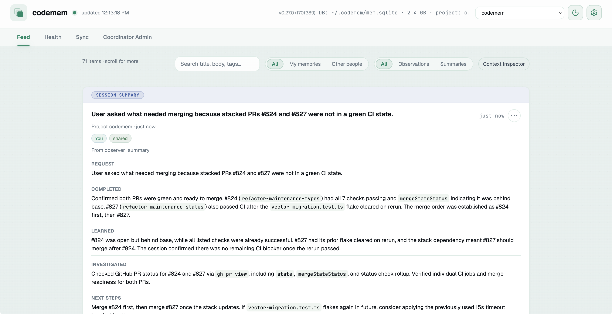
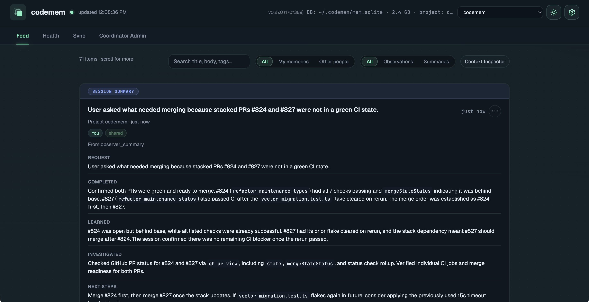
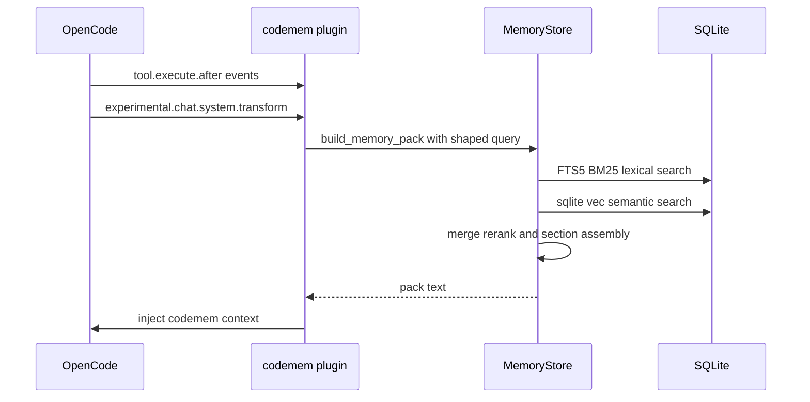

# codemem

[](https://github.com/kunickiaj/codemem/actions/workflows/ci.yml) [](https://codecov.io/gh/kunickiaj/codemem) [](https://github.com/kunickiaj/codemem/releases)

Persistent memory for [OpenCode](https://opencode.ai). codemem captures what you work on across sessions, retrieves relevant context using hybrid search, and injects it into future prompts automatically.

- **Local-first** — everything lives in SQLite on your machine
- **Hybrid retrieval** — FTS5 BM25 lexical search + sqlite-vec semantic search, merged and re-ranked
- **Automatic injection** — the OpenCode plugin injects context into every prompt, no manual steps
- **Built-in viewer** — browse memories, sessions, and observer output in a local web UI
- **Peer-to-peer sync** — replicate memories across machines without a central service

| Light | Dark |
|-------|------|
|  |  |

## Quick start

**Prerequisites:** Python 3.11+ and [uv](https://docs.astral.sh/uv/)

1. Install the CLI and plugin:

```bash
uv tool install --upgrade codemem
```

2. Add the plugin to your OpenCode config (`~/.config/opencode/opencode.jsonc`):

```json
{
  "$schema": "https://opencode.ai/config.json",
  "plugin": ["@kunickiaj/codemem"]
}
```

3. Restart OpenCode, then verify:

```bash
codemem stats
codemem raw-events-status
```

That's it. The plugin captures activity, builds memories, and injects context from here on.

> Migrating from `opencode-mem`? See [docs/rename-migration.md](docs/rename-migration.md).

## How it works

The plugin hooks into OpenCode's event system. It captures tool calls and conversation messages, flushes them through an observer pipeline that produces typed memories, and injects relevant context back into future prompts.



**Retrieval** combines two strategies: keyword search via SQLite FTS5 with BM25 scoring and semantic similarity via sqlite-vec embeddings. In the pack-building path, results from both are merged, deduplicated, and re-ranked using recency and memory-kind boosts.

**Injection** happens automatically. The plugin builds a query from the current session context (first prompt, latest prompt, project, recently modified files), calls `build_memory_pack`, and appends the result to the system prompt via `experimental.chat.system.transform`.

**Memories** are typed — `bugfix`, `feature`, `refactor`, `change`, `discovery`, `decision`, `exploration` — with structured fields like `facts`, `concepts`, `files_read`, and `files_modified` that improve retrieval relevance. Low-signal events are filtered at multiple layers before persistence.

For architecture details, see [docs/architecture.md](docs/architecture.md).

## CLI

| Command | Description |
|---------|-------------|
| `codemem stats` | Database statistics |
| `codemem recent` | Recent memories |
| `codemem search <query>` | Search memories |
| `codemem embed` | Backfill semantic embeddings |
| `codemem serve` | Launch the web viewer |
| `codemem db prune-memories` | Deactivate low-signal memories (`--dry-run` to preview) |
| `codemem export-memories` | Export memories by project |
| `codemem import-memories` | Import memories (idempotent) |
| `codemem sync` | Peer-to-peer sync commands |

Run `codemem --help` for the full list.

## MCP tools

To give the LLM direct access to memory tools (search, timeline, pack, remember, forget):

```bash
codemem install-mcp
```

This updates your OpenCode config to register the MCP server. Restart OpenCode to activate.

## Configuration

Config file: `~/.config/codemem/config.json` (override with `CODEMEM_CONFIG`). Environment variables take precedence over file settings.

Common overrides:

| Variable | Purpose |
|----------|---------|
| `CODEMEM_DB` | SQLite database path |
| `CODEMEM_INJECT_CONTEXT` | `0` to disable automatic context injection |
| `CODEMEM_VIEWER_AUTO` | `0` to disable auto-starting the viewer |

The viewer includes a Settings modal for observer provider, model, and max chars.

## Export and import

Share project knowledge with teammates or back up memories across machines.

```bash
# Export current project
codemem export-memories project.json

# Import on another machine (idempotent, safe to re-run)
codemem import-memories project.json --remap-project ~/workspace/myproject

# Import from claude-mem
codemem import-from-claude-mem ~/.claude-mem/claude-mem.db
```

See `codemem export-memories --help` and `codemem import-memories --help` for full options.

## Peer-to-peer sync

Replicate memories across devices without a central server.

```bash
codemem sync enable        # generate device keys
codemem sync pair          # generate pairing payload
codemem sync daemon        # start sync daemon
codemem sync install       # autostart on macOS + Linux
```

Project filters, per-peer overrides, and config keys are documented in [docs/user-guide.md](docs/user-guide.md).

## Semantic recall

Embeddings are stored in sqlite-vec and written automatically when memories are created. Use `codemem embed` to backfill existing memories. If sqlite-vec cannot load, keyword search still works.

> **aarch64 Linux note:** The PyPI wheels currently ship a 32-bit `vec0.so` on aarch64. See [docs/user-guide.md](docs/user-guide.md) for the workaround.

## Alternative install methods

<details>
<summary>Local development, uvx, git install</summary>

### Local development

```bash
uv sync
source .venv/bin/activate  # bash/zsh
source .venv/bin/activate.fish  # fish
codemem --help
```

### Via uvx (no install)

```bash
uvx --from git+ssh://git@github.com/kunickiaj/codemem.git codemem stats
```

### Install from GitHub

```bash
uv pip install git+ssh://git@github.com/kunickiaj/codemem.git
```

### Plugin from git (advanced)

```bash
uvx --from git+ssh://git@github.com/kunickiaj/codemem.git codemem install-plugin
```

### Plugin for development

Start OpenCode inside the codemem repo directory — the plugin auto-loads from `.opencode/plugin/`.

</details>

## Documentation

- [Architecture](docs/architecture.md) — data flow, retrieval, observer pipeline, design tradeoffs
- [User guide](docs/user-guide.md) — viewer usage, sync setup, troubleshooting
- [Plugin reference](docs/plugin-reference.md) — plugin behavior, env vars, stream reliability
- [Migration guide](docs/rename-migration.md) — migrating from `opencode-mem`
- [Contributing](CONTRIBUTING.md) — development setup, tests, linting, releases
