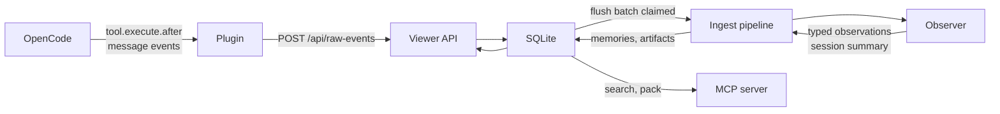
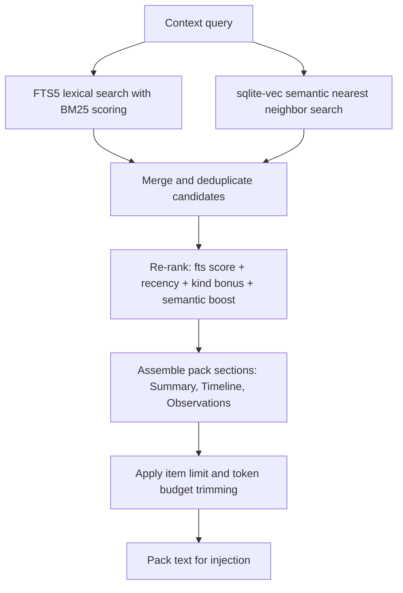
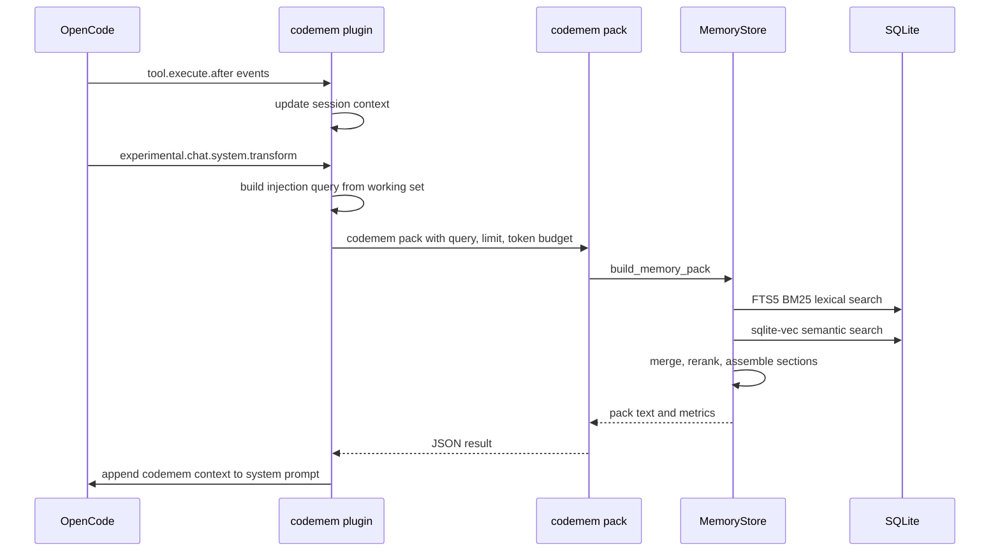
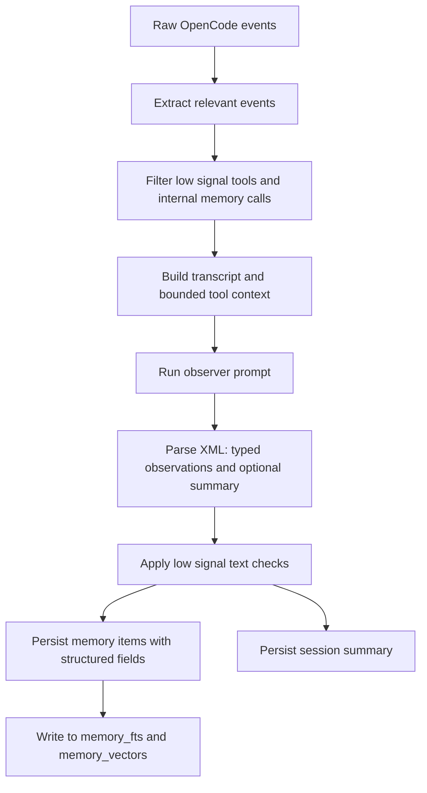

# Architecture

codemem has five main pieces: a **plugin** that captures OpenCode activity, an **ingest pipeline** that turns raw events into typed memories, a **store** backed by SQLite, a **retrieval system** that combines keyword and semantic search, and a **viewer** for browsing everything.

## Components

| Component | What it does | Key files |
|-----------|-------------|-----------|
| Plugin | Captures OpenCode events, streams them to the viewer API | `.opencode/plugin/codemem.js` |
| Ingest pipeline | Extracts tool events, builds transcripts, runs the observer | `codemem/plugin_ingest.py`, `codemem/ingest/` |
| Observer | Produces typed observations and session summaries from transcripts | `codemem/observer_prompts.py`, `codemem/xml_parser.py` |
| Store | SQLite persistence for sessions, memories, artifacts, embeddings | `codemem/store/`, `codemem/db.py` |
| Viewer | Local web UI + JSON APIs for stats, sessions, and memory items | `codemem/viewer.py`, `codemem/viewer_routes/` |
| MCP server | Exposes memory tools (search, timeline, pack, remember, forget) to OpenCode | `codemem/mcp_server.py` |
| CLI | Ties everything together: ingest, serve, search, export/import, sync | `codemem/cli_app.py` |

## Data flow



1. The plugin captures tool calls and conversation messages during an OpenCode session.
2. It streams raw events to the viewer's ingest API (`POST /api/raw-events`) with preflight health checks (`GET /api/raw-events/status`).
3. The viewer/store persists raw events and queues durable flush batches.
4. Idle and sweeper workers claim batches and run them through ingest.
5. Ingest builds a transcript from user prompts and assistant messages, then hands it to the observer.
6. The observer returns typed observations and an optional session summary as XML.
7. Ingest writes artifacts (transcript, context snapshots), observations, and summaries to SQLite.
8. The viewer, MCP server, and CLI all read from the same SQLite database.

## Retrieval

Retrieval has two search backends and a merge/re-rank layer that combines them for pack construction.

### Lexical search (FTS5 + BM25)

The `memory_fts` virtual table is an FTS5 index over `title`, `body_text`, and `tags_text` from `memory_items`. It's kept in sync automatically via SQLite triggers on insert, update, and delete.

Search queries go through `_expand_query` (OR-joined tokens) and are scored with `-bm25(memory_fts, 1.0, 1.0, 0.25)`. Results are ordered by a weighted combination of BM25 score and recency in the SQL query itself:

```sql
ORDER BY (score * 1.5 + recency) DESC
```

where `recency = 1.0 / (1.0 + (days_ago / 7.0))`.

This is the baseline search path used by `codemem search`, MCP `memory_search`, and as input to pack construction.

### Semantic search (sqlite-vec)

When embeddings are available, `memory_vectors` (a `vec0` virtual table from sqlite-vec) stores 384-dimensional float vectors keyed by `memory_id`. Vectors are written automatically when memories are created, or backfilled with `codemem embed`.

Semantic search embeds the query text, then runs a nearest-neighbor lookup against `memory_vectors`. Distance is converted to a similarity score: `1.0 / (1.0 + distance)`.

If sqlite-vec can't load (e.g., missing native extension), semantic search is silently skipped and keyword search still works.

### Hybrid merge and re-rank (pack path)

In the pack-building path — CLI `pack`/`inject`, MCP `memory_pack`, and plugin injection — results from both backends are merged and re-ranked. This happens in `_merge_ranked_results` (`codemem/store/search.py`):

1. Run FTS5 search to get lexical candidates.
2. Run semantic search to get vector candidates.
3. Merge candidates, deduplicating by memory ID.
4. Re-rank the merged set using a composite score.

The re-ranking formula in hybrid mode (`_rerank_results_hybrid`):

```
score = (fts_score * 1.2) + (recency * 0.8) + kind_bonus + semantic_boost

where:
  fts_score    = -bm25(memory_fts, 1.0, 1.0, 0.25)
  recency      = 1.0 / (1.0 + days_ago / 7.0)
  kind_bonus   = 0.25 (session_summary), 0.2 (decision), 0.15 (note),
                 0.1 (observation), 0.05 (entities), 0.0 (others)
  semantic_boost = 0.35 if the memory ID was returned by vector search, else 0.0
```

In baseline mode (hybrid disabled), the formula is slightly different: `fts_score * 1.5 + recency + kind_bonus` with no semantic boost.

**Scope note:** Hybrid merge/re-rank only runs in the pack-building path. Direct search endpoints (`codemem search`, MCP `memory_search`) use FTS5 scoring with recency weighting but don't merge semantic results.



## Context injection

The plugin injects a memory pack into the system prompt on every turn. This is the primary way codemem delivers value — it happens automatically, no manual steps required.

### How the query is built

The plugin constructs a search query from the current session's working set (`resolveInjectQuery` in the plugin):

- **First prompt** — captures the session's original intent (most stable signal)
- **Latest prompt** — adds current focus (skipped if identical to first prompt or trivially short)
- **Project name** — scopes results to the active project
- **Recently modified files** — last 5 filenames from `tool.execute.after` events with `edit`/`write` tools

These are concatenated into a single query string, capped at 500 characters.

### How the pack is built

`build_memory_pack` (`codemem/store/packs.py`) assembles three sections:

1. **Summary** — the most recent `session_summary` matching the query (or the latest one if none match)
2. **Timeline** — recent memories from search results, ordered by relevance
3. **Observations** — typed memories (`decision`, `feature`, `bugfix`, `refactor`, `change`, `discovery`, `exploration`, `note`) sorted by tag overlap with the query, then recency, then kind priority

Items are deduplicated across sections. If the query looks like a task lookup ("todo", "pending", "what's next") or a recall query ("what did we do", "last time"), the pack uses specialized retrieval paths that prioritize relevant kinds and recency.

### Limits

- **Item limit** (`limit`, default from `pack_observation_limit` config, typically 50) — caps total memory items considered
- **Token budget** (`token_budget`) — when set, sections are trimmed once the running token count exceeds the budget; earlier sections (Summary, Timeline) get priority

In plugin mode, these can be overridden via `CODEMEM_INJECT_LIMIT` and `CODEMEM_INJECT_TOKEN_BUDGET`.

### Injection hook

The plugin uses `experimental.chat.system.transform` to append the pack text to the system prompt. It caches the pack per session and re-fetches when the query changes (i.e., when prompts or file activity shift context). A toast notification shows injection stats on first inject per session.



## Observer pipeline

The observer turns raw session transcripts into typed, structured memories. It's the quality gate — everything that ends up in the store passes through here.

### Memory taxonomy

Observations use a fixed set of kinds defined in `codemem/memory_kinds.py`:

| Kind | When to use | Example |
|------|------------|---------|
| `decision` | A tradeoff was made or an approach chosen | "Switched to async cache to avoid lock contention" |
| `discovery` | Something new was learned about the codebase or domain | "The billing service uses event sourcing internally" |
| `bugfix` | A bug was identified and fixed | "Fixed retry loop that caused duplicate webhook delivery" |
| `feature` | New functionality was added | "Added CSV export to the reports page" |
| `refactor` | Code was restructured without changing behavior | "Extracted auth middleware into shared package" |
| `change` | A general code change that doesn't fit the above | "Updated CI config to run tests in parallel" |
| `exploration` | Something was tried but not shipped (preserves "why not") | "Tried Redis for session store, reverted due to complexity" |
| `note` | Small useful facts worth remembering | "The staging DB password rotates weekly" |
| `observation` | General observations from session activity | "Test suite takes 4 minutes on this repo" |
| `session_summary` | Auto-generated session summary | (produced by the observer, not typically created manually) |
| `entities` | Notable services, components, or domains mentioned | (auto-extracted) |

### Low-signal filtering

Noise control happens at three layers:

1. **Event extraction** (`codemem/ingest/events.py`) — Low-signal tool types (`tui`, `shell`, `task`, `slashcommand`, `skill`, `todowrite`, `askuserquestion`) are dropped before they reach the observer. Internal codemem memory tools (anything starting with `codemem_memory_`) are also excluded to prevent feedback loops.

2. **Observer prompt guidance** (`codemem/observer_prompts.py`) — The observer prompt instructs the LLM to skip routine/noise-only work and focus on meaningful changes, decisions, and discoveries.

3. **Post-observer text filtering** (`codemem/summarizer.py`) — `is_low_signal_observation` applies regex patterns to catch formulaic low-value outputs that the observer sometimes produces despite guidance (e.g., "no code changes were recorded", "only file inspection occurred").

### Structured fields

Each observation is persisted with structured metadata that improves retrieval:

- **`facts`** — discrete factual statements extracted from the observation
- **`concepts`** — domain concepts and technical terms mentioned
- **`files_read`** / **`files_modified`** — file paths involved in the work
- **`narrative`** — the full observation text
- **`tags_text`** — auto-derived from kind, concepts, and file paths (`codemem/store/tags.py`); used in FTS5 indexing

These fields feed into tag derivation, which directly influences FTS5 recall and pack section ordering (tag overlap with the query boosts observation ranking).



## Plugin flush strategy

The plugin buffers events in memory and flushes them to the viewer API on session boundaries.

### Event-based triggers
- `session.idle` — flushes current buffer
- `session.created` — flushes before switching to a new session
- `/new` command — detected from user prompt text, flushes before context switch
- `session.error` — immediate flush

### Threshold-based force flush
- 50+ tool executions OR 15+ prompts
- 10+ minutes of continuous work

### Stream reliability
- Preflight check: `GET /api/raw-events/status` with periodic re-checks (`CODEMEM_RAW_EVENTS_STATUS_CHECK_MS`)
- Backoff on failure: configurable via `CODEMEM_RAW_EVENTS_BACKOFF_MS`
- Once batches are accepted by the viewer/store queue, flush workers handle retries

## Design tradeoffs

codemem is built for **episodic memory** — remembering what happened across coding sessions: what was tried, changed, decided, and learned. It's good at:

- Recalling past decisions and their rationale
- Surfacing relevant context from previous sessions automatically
- Tracking what was explored but not shipped (and why)
- Low-friction integration that works without changing how you use OpenCode

It's **not** a structural code intelligence engine. It doesn't build symbol graphs, parse ASTs, or maintain a full map of your codebase structure. If you need "find all callers of this function" or "show me the dependency graph for this module", that's a different tool.

The bet is that for day-to-day coding with an LLM, session-level episodic memory (what you worked on, what you decided, what you learned) is the highest-value context to inject — and that it should happen automatically without any manual bookkeeping.
