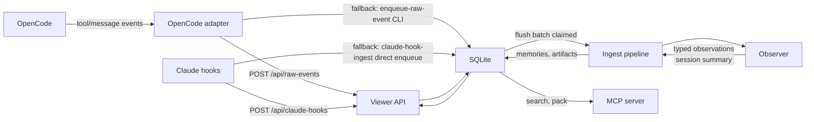
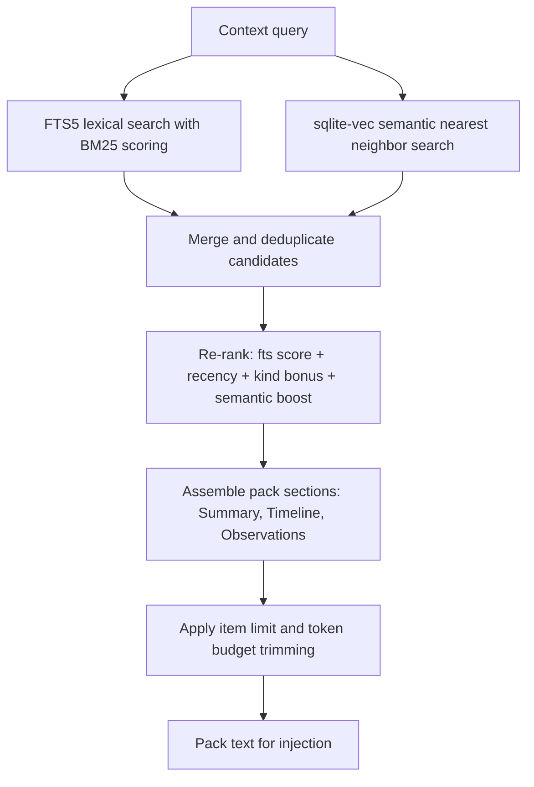
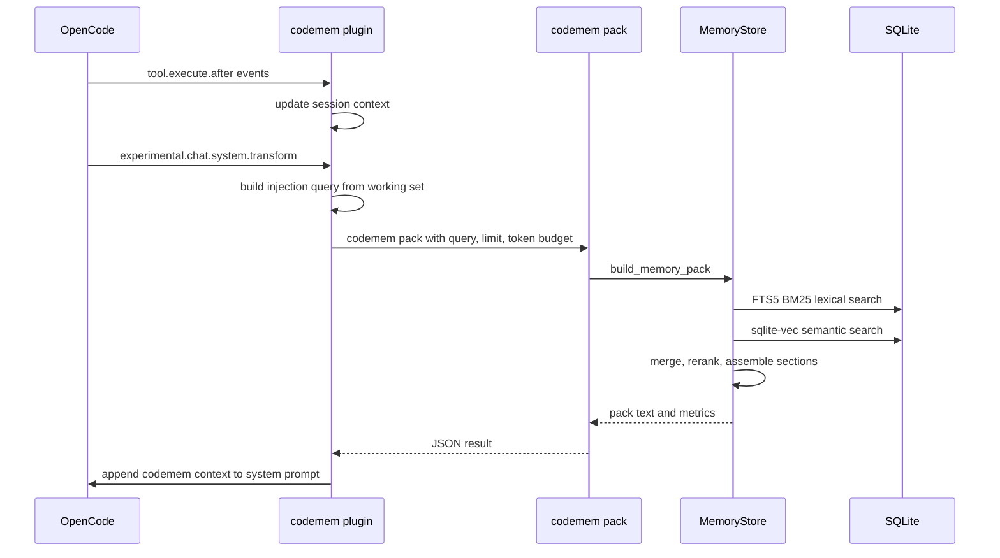
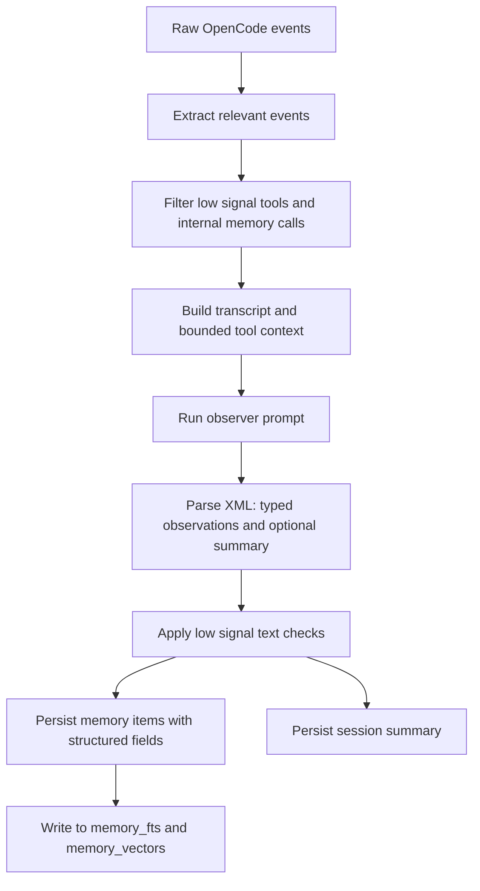

# Architecture

codemem has five main pieces: **adapters** that capture shell/runtime activity, an **ingest pipeline** that turns raw events into typed memories, a **store** backed by SQLite, a **retrieval system** that combines keyword and semantic search, and a **viewer** for browsing everything.

## Components

| Component | What it does | Key files |
|-----------|-------------|-----------|
| Adapters | Capture OpenCode/Claude events and enqueue raw events for ingest | `packages/opencode-plugin/.opencode/plugins/codemem.js`, `plugins/claude/scripts/ingest-hook.sh`, `packages/core/src/claude-hooks.ts` |
| Ingest pipeline | Extracts tool events, builds transcripts, runs the observer | `packages/core/src/ingest-pipeline.ts`, `packages/core/src/ingest-events.ts` |
| Observer | Produces typed observations and session summaries from transcripts | `packages/core/src/ingest-prompts.ts`, `packages/core/src/ingest-xml-parser.ts` |
| Store | SQLite persistence for sessions, memories, artifacts, embeddings | `packages/core/src/store.ts`, `packages/core/src/schema.ts` |
| Viewer | Local web UI + JSON APIs for stats, sessions, and memory items | `packages/viewer-server/src/`, `packages/ui/src/` |
| MCP server | Exposes memory tools (search, timeline, pack, remember, forget) to OpenCode | `packages/mcp-server/src/` |
| CLI | Ties everything together: ingest, serve, search, export/import, sync | `packages/cli/src/` |

The viewer trust model is intentionally local-first: it is designed for loopback access from the same machine, with
cross-origin protections for browser callers and limited config-route guardrails, but not a full remote auth/session
boundary.

## Data flow


```mermaid
flowchart LR
    OC["OpenCode"] -->|tool/message events| OCA["OpenCode adapter"]
    OCA -->|POST /api/raw-events| VW["Viewer API"]
    OCA -->|fallback: enqueue-raw-event CLI| DB
    CH["Claude hooks"] -->|POST /api/claude-hooks| VW
    CH -->|fallback: claude-hook-ingest direct enqueue| DB
    VW --> DB["SQLite"]
    DB -->|flush batch claimed| IN["Ingest pipeline"]
    IN --> OB["Observer"]
    OB -->|typed observations\nsession summary| IN
    IN -->|memories, artifacts| DB
    DB -->|search, pack| MCP["MCP server"]
    DB --> VW
```

1. Adapters capture tool/conversation lifecycle events and normalize them into raw events with optional `_adapter` envelopes.
2. OpenCode streams raw events to the viewer ingest API (`POST /api/raw-events`) with preflight checks (`GET /api/raw-events/status`) and can fall back to CLI queue enqueue when stream writes fail.
3. Claude hook ingestion posts to `POST /api/claude-hooks` first and falls back to `codemem claude-hook-ingest` direct enqueue when the local viewer API is unavailable.
4. The viewer/store persists raw events and queues durable flush batches.
5. Idle and sweeper workers claim batches and run them through ingest.
6. Ingest builds a transcript from user prompts and assistant messages, then hands it to the observer.
7. The observer returns typed observations and an optional session summary as XML.
8. Ingest writes artifacts (transcript, context snapshots), observations, and summaries to SQLite.
9. The viewer, MCP server, and CLI all read from the same SQLite database.

## Adapter support matrix and rollout

Support tiers describe operational expectations for each adapter path:

- Supported: shipped in normal workflows, covered by integration tests, and maintained for reliability regressions.
- Partial: usable for targeted workflows, but with known gaps and narrower guarantees.
- Experimental: architecture path or branch exists, but not ready for general use.

| Adapter | Tier | Notes |
|---|---|---|
| OpenCode plugin | Supported | Primary reference adapter for lifecycle events and injection behavior. |
| Claude hooks/plugin | Supported | Hook-first queue path with CLI/runtime fallback and parity slices tracked in adapter stack PRs. |
| Codex shell integration | Experimental | Planned as adapter-native ingestion path; no user-facing support contract yet. |
| Windsurf integration | Experimental | Planned via shared adapter contract after OpenCode/Claude stabilization. |
| Cursor integration | Experimental | Planned via shared adapter contract after OpenCode/Claude stabilization. |

Rollout sequencing:

1. Stabilize adapter schema + queue/flush reliability.
2. Reach OpenCode parity on ingest + retrieval quality.
3. Ship Claude MVP, then close parity gaps (injection/capture/lifecycle).
4. Keep Claude in Supported tier by enforcing reliability and review gates.
5. Add additional adapters (Codex/Windsurf/Cursor) behind the same contract.

Explicit non-goals:

- No generic bash/zsh/fish shell-hook wrapper strategy.
- No "one script fits all shells" ingestion shim.
- No adapter-specific storage schema forks; adapters share one normalized raw-event/store path.

## Retrieval

Retrieval has two search backends and a merge/re-rank layer that combines them for pack construction.

### Lexical search (FTS5 + BM25)

The `memory_fts` virtual table is an FTS5 index over `title`, `body_text`, and `tags_text` from `memory_items`. It's kept in sync automatically via SQLite triggers on insert, update, and delete.

Search queries go through `_expand_query` (OR-joined tokens) and are scored with `-bm25(memory_fts, 1.0, 1.0, 0.25)`. Results are ordered by a weighted combination of BM25 score and recency in the SQL query itself:

```sql
ORDER BY (score * 1.5 + recency) DESC
```

where `recency = 1.0 / (1.0 + (days_ago / 7.0))`.

This is the baseline search path used by `codemem search`, MCP `memory_search`, and as input to pack construction.

Contributor-aware retrieval layers on top of this baseline without changing the storage model:

- actor filters: `include_actor_ids` / `exclude_actor_ids`
- visibility filters: `include_visibility` / `exclude_visibility` with `private|shared`
- workspace filters: `include_workspace_ids`, `exclude_workspace_ids`, `include_workspace_kinds`, `exclude_workspace_kinds`
- `personal_first`: enabled by default, adding a ranking bonus for memories authored by the local actor

New memories default to `visibility=private`. Shared memories (`visibility=shared`) remain part of the same retrieval corpus but are the only memories eligible for peer-to-peer replication.

`trust_state` is intentionally lightweight in MVP:

- `trusted` - normal fully-known local/shared provenance
- `legacy_unknown` - older synced data backfilled from incomplete provenance
- `unreviewed` - reserved for future review workflows

It does not currently gate sync or retrieval. See `docs/plans/2026-03-08-shared-memory-trust-state-semantics.md` for the contract.

### Semantic search (sqlite-vec)

When embeddings are available, `memory_vectors` (a `vec0` virtual table from sqlite-vec) stores 384-dimensional float vectors keyed by `memory_id`. Vectors are written automatically when memories are created, or backfilled with `codemem embed`.

Semantic search embeds the query text, then runs a nearest-neighbor lookup against `memory_vectors`. Distance is converted to a similarity score: `1.0 / (1.0 + distance)`.

If sqlite-vec can't load (e.g., missing native extension), semantic search is silently skipped and keyword search still works.

### Hybrid merge and re-rank (pack path)

In the pack-building path — CLI `pack`/`inject`, MCP `memory_pack`, and plugin injection — results from both backends are merged and re-ranked. This happens in the hybrid merge layer (`packages/core/src/search.ts`):

1. Run FTS5 search to get lexical candidates.
2. Run semantic search to get vector candidates.
3. Merge candidates, deduplicating by memory ID.
4. Re-rank the merged set using a composite score.

The re-ranking formula in hybrid mode (`_rerank_results_hybrid`):

```
score = (base_score * 1.2) + (recency * 0.8) + kind_bonus + semantic_boost

where:
  base_score   = lexical candidates: -bm25(memory_fts, 1.0, 1.0, 0.25)
                 semantic-only candidates: 1.0 / (1.0 + distance)
  recency      = 1.0 / (1.0 + days_ago / 7.0)
  kind_bonus   = 0.25 (session_summary), 0.2 (decision), 0.15 (note),
                 0.1 (observation), 0.05 (entities), 0.0 (others)
  semantic_boost = 0.35 if the memory ID was returned by vector search, else 0.0
```

In baseline mode (hybrid disabled), the formula is slightly different: `base_score * 1.5 + recency + kind_bonus` with no semantic boost.

**Scope note:** Hybrid merge/re-rank only runs in the pack-building path. Direct search endpoints (`codemem search`, MCP `memory_search`) use FTS5 scoring with recency weighting, actor/workspace filters, and personal-first ranking bias, but don't merge semantic results.


```mermaid
flowchart TD
    Q["Context query"] --> L["FTS5 lexical search with BM25 scoring"]
    Q --> S["sqlite-vec semantic nearest neighbor search"]
    L --> M["Merge and deduplicate candidates"]
    S --> M
    M --> R["Re-rank: fts score + recency + kind bonus + semantic boost"]
    R --> P["Assemble pack sections: Summary, Timeline, Observations"]
    P --> B["Apply item limit and token budget trimming"]
    B --> OUT["Pack text for injection"]
```

## Context injection

The plugin injects a memory pack into the system prompt on every turn. This is the primary way codemem delivers value — it happens automatically, no manual steps required.

Feed and retrieval surfaces can scope the corpus without splitting storage into separate pools:

- `all` - all memories visible to the local actor
- `mine` - only memories authored by the current `actor_id`
- `shared` - only memories marked `visibility=shared`

### How the query is built

The plugin constructs a search query from the current session's working set (`resolveInjectQuery` in the plugin):

- **First prompt** — captures the session's original intent (most stable signal)
- **Latest prompt** — adds current focus (skipped if identical to first prompt or trivially short)
- **Project name** — scopes results to the active project
- **Recently modified files** — last 5 filenames from `tool.execute.after` events with `edit`/`write` tools

These are concatenated into a single query string, capped at 500 characters.

### How the pack is built

`buildMemoryPack` (`packages/core/src/pack.ts`) assembles three sections:

1. **Summary** — the most recent `session_summary` matching the query (or the latest one if none match)
2. **Timeline** — recent memories from search results, ordered by relevance
3. **Observations** — typed memories (`decision`, `feature`, `bugfix`, `refactor`, `change`, `discovery`, `exploration`, `note`) sorted by tag overlap with the query, then recency, then kind priority

Items are deduplicated across sections. If the query looks like a task lookup ("todo", "pending", "what's next") or a recall query ("what did we do", "last time"), the pack uses specialized retrieval paths that prioritize relevant kinds and recency.

### Limits

- **Item limit** (`limit`, default from `pack_observation_limit` config, typically 50) — caps total memory items considered
- **Token budget** (`token_budget`) — when set, sections are trimmed once the running token count exceeds the budget; earlier sections (Summary, Timeline) get priority

In plugin mode, these can be overridden via `CODEMEM_INJECT_LIMIT` and `CODEMEM_INJECT_TOKEN_BUDGET`.

### Injection hook

The plugin uses `experimental.chat.system.transform` to append the pack text to the system prompt. It caches the pack per session and re-fetches when the query changes (i.e., when prompts or file activity shift context). A toast notification shows injection stats on first inject per session.


```mermaid
sequenceDiagram
participant OC as OpenCode
participant PL as codemem plugin
participant CLI as codemem pack
participant ST as MemoryStore
participant DB as SQLite

OC->>PL: tool.execute.after events
PL->>PL: update session context
OC->>PL: experimental.chat.system.transform
PL->>PL: build injection query from working set
PL->>CLI: codemem pack with query, limit, token budget
CLI->>ST: build_memory_pack
ST->>DB: FTS5 BM25 lexical search
ST->>DB: sqlite-vec semantic search
ST->>ST: merge, rerank, assemble sections
ST-->>CLI: pack text and metrics
CLI-->>PL: JSON result
PL->>OC: append codemem context to system prompt
```

## Observer pipeline

The observer turns raw session transcripts into typed, structured memories. It's the quality gate — everything that ends up in the store passes through here.

### Runtime and auth adapter

- The observer still uses one pipeline (extract -> prompt -> parse -> persist); runtime/auth choices are adapter inputs, not a separate path.
- Supported runtime values are `api_http` and `claude_sidecar`.
- `claude_sidecar` executes observer prompts through local Claude runtime auth and bypasses provider API-key client initialization.
- `claude_sidecar` command launch is configurable with `claude_command` / `CODEMEM_CLAUDE_COMMAND` (JSON argv; default `["claude"]`).
- Runtime defaults: `api_http` uses `gpt-5.1-codex-mini`; `claude_sidecar` uses `claude-4.5-haiku` unless explicitly overridden.
- If a configured `observer_model` is not available in Claude CLI, codemem retries once with Claude's default model.
- Supported auth sources are `auto`, `env`, `file`, `command`, `none`.
- `observer_auth_command` is argv data and must be a JSON string array when passed via env (`CODEMEM_OBSERVER_AUTH_COMMAND`).
- Header templating supports `${auth.token}`, `${auth.type}`, `${auth.source}`.
- `file`/`command` auth resolution caches successful tokens for TTL and does not cache failures.
- Custom provider auth does not implicitly consume OpenCode/IAP env fallback tokens.

### Memory taxonomy

Observations use a fixed set of kinds defined in `packages/core/src/store.ts`:

| Kind | When to use | Example |
|------|------------|---------|
| `decision` | A tradeoff was made or an approach chosen | "Switched to async cache to avoid lock contention" |
| `discovery` | Something new was learned about the codebase or domain | "The billing service uses event sourcing internally" |
| `bugfix` | A bug was identified and fixed | "Fixed retry loop that caused duplicate webhook delivery" |
| `feature` | New functionality was added | "Added CSV export to the reports page" |
| `refactor` | Code was restructured without changing behavior | "Extracted auth middleware into shared package" |
| `change` | A general code change that doesn't fit the above | "Updated CI config to run tests in parallel" |
| `exploration` | Something was tried but not shipped (preserves "why not") | "Tried Redis for session store, reverted due to complexity" |
| `note` | Small useful facts worth remembering | "The staging DB password rotates weekly" |
| `observation` | General observations from session activity | "Test suite takes 4 minutes on this repo" |
| `session_summary` | Auto-generated session summary | (produced by the observer, not typically created manually) |
| `entities` | Notable services, components, or domains mentioned | (auto-extracted) |

### Low-signal filtering

Noise control happens at three layers:

1. **Event extraction** (`packages/core/src/ingest-events.ts`) — Low-signal tool types (`tui`, `shell`, `task`, `slashcommand`, `skill`, `todowrite`, `askuserquestion`) are dropped before they reach the observer. Internal codemem memory tools (anything starting with `codemem_memory_`) are also excluded to prevent feedback loops.

2. **Observer prompt guidance** (`packages/core/src/ingest-prompts.ts`) — The observer prompt instructs the LLM to skip routine/noise-only work and focus on meaningful changes, decisions, and discoveries.

3. **Post-observer text filtering** (`packages/core/src/ingest-filters.ts`) — `isLowSignalObservation` applies regex patterns to catch formulaic low-value outputs that the observer sometimes produces despite guidance (e.g., "no code changes were recorded", "only file inspection occurred").

### Structured fields

Each observation is persisted with structured metadata that improves retrieval:

- **`facts`** — discrete factual statements extracted from the observation
- **`concepts`** — domain concepts and technical terms mentioned
- **`files_read`** / **`files_modified`** — file paths involved in the work
- **`narrative`** — the full observation text
- **`tags_text`** — auto-derived from kind, concepts, and file paths (`packages/core/src/tags.ts`); used in FTS5 indexing

These fields feed into tag derivation, which directly influences FTS5 recall and pack section ordering (tag overlap with the query boosts observation ranking).


```mermaid
flowchart TD
A["Raw OpenCode events"] --> B["Extract relevant events"]
B --> C["Filter low signal tools and internal memory calls"]
C --> D["Build transcript and bounded tool context"]
D --> E["Run observer prompt"]
E --> F["Parse XML: typed observations and optional summary"]
F --> G["Apply low signal text checks"]
G --> H["Persist memory items with structured fields"]
G --> I["Persist session summary"]
H --> J["Write to memory_fts and memory_vectors"]
```

## Adapter flush strategy

The OpenCode adapter streams each captured event to the viewer API (`captureEvent` -> `emitRawEvent`) and keeps an in-memory event list for session accounting and reset behavior.

When stream delivery is unavailable, the adapter can enqueue raw events through the CLI fallback path (`enqueue-raw-event`) so events still enter durable queue processing.

Claude hook ingestion is enqueue-first (`POST /api/claude-hooks`) with CLI fallback. The route nudges the raw-event
sweeper after enqueue, but actual auto-flush still depends on `CODEMEM_RAW_EVENTS_AUTO_FLUSH=1`; otherwise processing
waits for the normal idle/sweeper path. `CODEMEM_CLAUDE_HOOK_FLUSH_ON_STOP=1` remains a separate opt-in for `Stop`
events.

### OpenCode session finalization triggers
- `session.idle` — finalizes current local buffer
- `session.created` — finalizes before switching to a new session
- `/new` command — detected from user prompt text, finalizes before context switch
- `session.error` — immediate finalize

### Threshold-based force flush
- 50+ tool executions OR 15+ prompts
- 10+ minutes of continuous work

### OpenCode stream reliability
- Preflight check: `GET /api/raw-events/status` with periodic re-checks (`CODEMEM_RAW_EVENTS_STATUS_CHECK_MS`)
- Backoff on failure: configurable via `CODEMEM_RAW_EVENTS_BACKOFF_MS`; on stream failure the plugin can fall back to CLI enqueue for durable persistence
- Once events are accepted by the viewer/store queue, flush workers handle retries

### Claude hook flush boundaries
- `CODEMEM_CLAUDE_HOOK_FLUSH=1` enables immediate `SessionEnd` boundary flush attempts
- `CODEMEM_CLAUDE_HOOK_FLUSH_ON_STOP=1` extends immediate flush to `Stop` when boundary flush is enabled

## Design tradeoffs

codemem is built for **episodic memory** — remembering what happened across coding sessions: what was tried, changed, decided, and learned. It's good at:

- Recalling past decisions and their rationale
- Surfacing relevant context from previous sessions automatically
- Tracking what was explored but not shipped (and why)
- Low-friction integration that works without changing how you use OpenCode

It's **not** a structural code intelligence engine. It doesn't build symbol graphs, parse ASTs, or maintain a full map of your codebase structure. If you need "find all callers of this function" or "show me the dependency graph for this module", that's a different tool.

The bet is that for day-to-day coding with an LLM, session-level episodic memory (what you worked on, what you decided, what you learned) is the highest-value context to inject — and that it should happen automatically without any manual bookkeeping.
