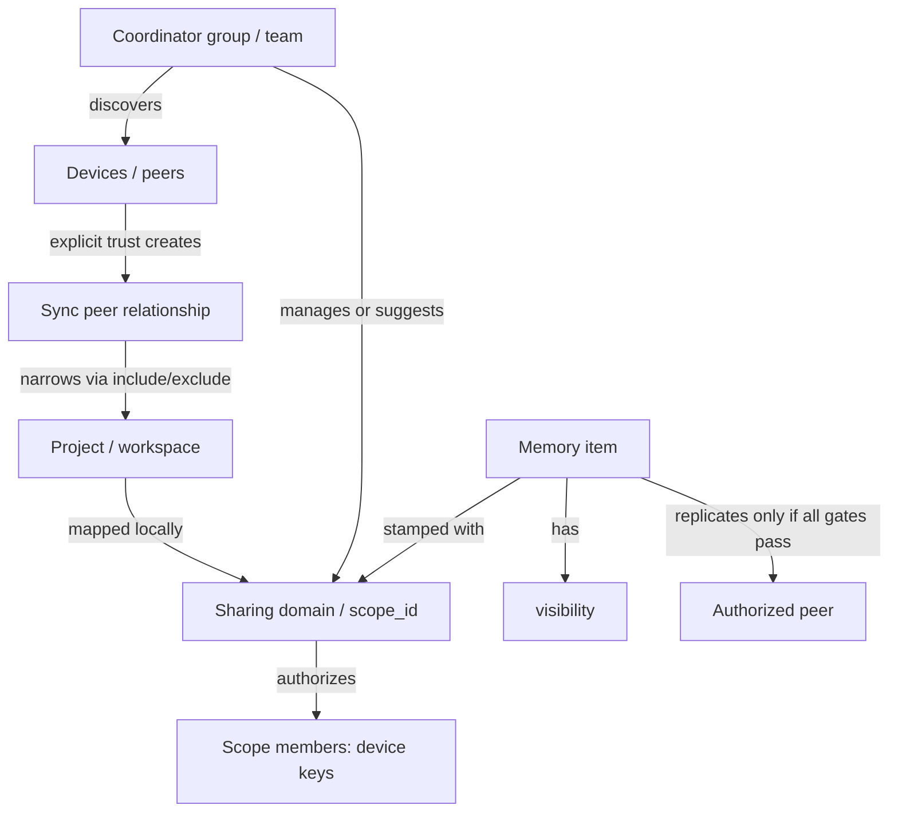

# Sharing Domain / Replication Scope Design

**Date:** 2026-04-30  
**Status:** design / pre-implementation  
**Related:** `2026-04-30-seed-and-mesh-architecture-converged.md`, `2026-04-30-seed-and-mesh-architecture-research.md`, `2026-04-22-multi-team-coordinator-groups-design.md`, `2026-03-08-shared-memory-trust-state-semantics.md`

When this document conflicts with `2026-04-30-seed-and-mesh-architecture-research.md`, the converged Syncthing-shaped position wins: no quorum backbone, no coordinator-as-gateway, no coordinator data path, and no special seed protocol role.

## Authoritative invariants (mirror)

These mirror the invariants in `2026-04-30-seed-and-mesh-architecture-converged.md` and govern all scope-related work. The converged doc holds the canonical wording; this list is for orientation:

1. Sharing domain (`scope_id`) is the hard data boundary in Phase 2; legacy compatibility is an audited exception, not an exemption.
2. Project include/exclude only narrows; basename matches are display-only.
3. Coordinator group membership is not data access; scope grants are explicit and audited.
4. Coordinator is never a data path.
5. Seed/anchor peers are deployment artifacts, not protocol roles.
6. Visibility gates eligibility; scope membership gates destination.
7. Revocation prevents future sync; outbound MUST re-validate membership per op batch; default cache TTL ≤ 60 s.
8. Local-first; no quorum primitive.
9. `claimed_local_actor` is retracted in Phase 2; same-actor private sync moves to a signed `personal:<actor_id>` scope.
10. Local-only scopes (`authority_type='local'`) never replicate outbound.
11. Inbound `scope_id` is authoritative from the op row; receivers do not re-resolve.

Any change that loosens one of these invariants must supersede it explicitly in a dated decision doc.

## Decision summary

codemem should introduce a first-class **replication scope** as the hard trust and data-sharing boundary. Internally this should be represented as `scope_id`. User-facing surfaces should call it a **Sharing domain** unless a narrower product label emerges.

This separates concepts that are currently adjacent but overloaded:

| Concept | Meaning | Enforcement role |
|---|---|---|
| Project / workspace | Where a memory came from | Classification and user navigation |
| Replication scope / Sharing domain | The hard boundary that determines which devices may receive data | Primary sync authorization boundary |
| Coordinator group / team | Discovery, enrollment, admin, and defaults | Membership and policy management container |
| Peer project filters | Per-peer include/exclude narrowing | Secondary selection policy |
| Visibility | Whether a memory is eligible to leave the local device at all | Sync eligibility gate |
| Trust state | Provenance confidence | Descriptive metadata, not an auth gate |

The invariant is:

> **A memory may only replicate to a peer if the peer is authorized for the memory's `scope_id`. Project include/exclude filters can narrow that result, but they must never widen it.**

## Problem

codemem already has several scope-like ideas:

- `memory_items.workspace_id` and `workspace_kind` describe origin/workspace context.
- `memory_items.visibility` controls whether an item is private or shareable.
- `sync_peers.projects_include_json` and `projects_exclude_json` control peer-level project selection.
- Coordinator groups provide discovery/admin context and can seed default project filters.
- Retrieval and MCP tools can filter by actor, visibility, workspace, and trust metadata.

Those primitives work for the current peer-filter model, but they are not a strong enough boundary for mixed personal/work/team machines. A single codemem instance may contain memories for personal projects, employer work, OSS, and client projects. Some of those should never cross organizational boundaries even if a peer filter is broad or a coordinator group default is misconfigured.

Peer project filters answer “what does this peer care about?” They should not be the root security model. The system needs a stable field on each memory and replication op that answers “which sharing boundary owns this data?”

## Goals

- Make the sharing boundary explicit, durable, and visible.
- Keep local-first behavior: writes remain durable locally before replication.
- Preserve the converged peer-to-peer architecture: no coordinator data path, no quorum backbone.
- Support mixed personal/work machines safely.
- Keep coordinator groups as discovery/admin containers, not data boundaries.
- Preserve existing peer include/exclude filters as a compatibility and narrowing layer.
- Provide a migration path that defaults existing data safely.
- Create work tracks that can be implemented incrementally before anti-entropy or hinted handoff.
- Keep scope metadata non-authoritative and mostly invisible until membership authority and enforcement exist.

## Non-goals

- No coordinator-as-gateway or coordinator-proxied memory payloads.
- No quorum write semantics.
- No libp2p or new transport stack.
- No automatic deletion of data already copied to a revoked device.
- No cryptographic payload encryption design in this document; that is related but separate work.
- No immediate removal of existing project filters or workspace fields.
- No cross-org federation implementation in the first scope release.

## Terminology

### Sharing domain

The user-facing name for a replication scope. A sharing domain is the boundary a user understands: “Personal,” “Acme Work,” “Client A,” “OSS codemem.”

### `scope_id`

The internal stable identifier for a sharing domain. Every shareable memory and every replication op should eventually carry a `scope_id`.

### Project mapping

A local rule that maps an observed project/workspace to a default `scope_id`. Example: `/work/acme/*` maps to `acme-work`; `/Users/adam/personal/*` maps to `personal`.

#### Canonical workspace identity

Project mapping for any scope decision MUST use a canonical workspace identity. Basename-style names (e.g. `sessions.project = 'codemem'`) are display-only and never participate in scope resolution.

The canonical identity is the first non-empty value from this ladder:

1. `git_remote` (preferred when available — globally unique)
2. `git_remote + ':' + git_branch` when branch-level scoping is needed (rare; opt-in per mapping)
3. Absolute `cwd` from the session row, normalized (resolved symlinks, no trailing slash)
4. `workspace_id` (when set by an external integration)
5. The literal string `unmapped:<sha256-of-cwd-or-project>` if every signal above is missing

The resolver records which signal was used so the UI can show "matched on git_remote" vs "matched on cwd" for debugging.

Two projects with the same basename and different git remotes MUST resolve to different scopes. The resolver test suite includes this fixture explicitly.

Basename-only matches are allowed only in:

- the legacy peer compatibility filter (existing `sync_peers.projects_*` semantics, deprecated path);
- display strings shown to users.

Basename-only matches MUST NOT be used in:

- outbound scope authorization;
- inbound scope authorization;
- snapshot/reset boundary decisions;
- migration auto-promotion to a non-`legacy-shared-review` scope.

During migration, any historical row whose only signal is a basename-style `sessions.project` falls into `legacy-shared-review` regardless of how the existing `sync_peers.projects_include_json` would have routed it.

### Scope membership

The set of device keys authorized to read/write data in a `scope_id`. Membership may be published by a coordinator in v1 and should be shaped so group-admin device signatures can be added later.

### Peer policy

A per-peer narrowing layer. It can restrict projects, possibly directions, and future sync preferences, but it cannot grant access to a scope the peer is not authorized for.

## Conceptual model



## Enforcement model

Outbound replication should evaluate gates in this order:

1. **Scope gate** — the target peer must be a current authorized member of the memory/op `scope_id`.
2. **Visibility gate** — the memory must be shareable. Existing `visibility=shared` semantics remain the baseline.
3. **Peer project filter gate** — include/exclude project rules may narrow which memories the peer receives.
4. **Direction/policy gate** — future role/direction/policy fields may narrow further.

The important property is monotonic narrowing: each later gate can only remove data from the candidate set. No gate after the scope gate can add authorization.

Inbound replication should also verify scope membership before applying ops:

- The sending peer must be authorized for each op's `scope_id`.
- The receiving peer must also be a member of that `scope_id`; otherwise it should reject or quarantine the op.
- Legacy ops without `scope_id` are accepted only during migration under explicit compatibility rules.

## Data model proposal

### New local tables

#### `replication_scopes`

Local cache/config for sharing domains.

```sql
CREATE TABLE replication_scopes (
  scope_id TEXT PRIMARY KEY,
  label TEXT NOT NULL,
  kind TEXT NOT NULL DEFAULT 'user', -- personal | team | org | client | system | user
  authority_type TEXT NOT NULL DEFAULT 'local', -- local | coordinator | signed_manifest
  coordinator_id TEXT,
  group_id TEXT,
  manifest_issuer_device_id TEXT,
  membership_epoch INTEGER NOT NULL DEFAULT 0,
  manifest_hash TEXT,
  status TEXT NOT NULL DEFAULT 'active', -- active | archived | revoked
  created_at TEXT NOT NULL,
  updated_at TEXT NOT NULL
);
```

#### `project_scope_mappings`

Local mapping from projects/workspaces to default sharing domains.

```sql
CREATE TABLE project_scope_mappings (
  id INTEGER PRIMARY KEY,
  workspace_identity TEXT,
  project_pattern TEXT NOT NULL,
  scope_id TEXT NOT NULL,
  priority INTEGER NOT NULL DEFAULT 0,
  source TEXT NOT NULL DEFAULT 'user', -- user | coordinator_default | migration | inferred
  created_at TEXT NOT NULL,
  updated_at TEXT NOT NULL
);
```

Rules should be deterministic: highest priority wins; ties break by most specific pattern, then newest update. Exact project IDs should be preferred over broad path globs where possible.

Rows derived only from basename-style historical project data should default to review/suggestion status rather than silently authorizing sync into an organizational domain.

#### `scope_memberships`

Local cache of device membership by scope.

```sql
CREATE TABLE scope_memberships (
  scope_id TEXT NOT NULL,
  device_id TEXT NOT NULL,
  role TEXT NOT NULL DEFAULT 'member', -- member | admin | observer
  status TEXT NOT NULL DEFAULT 'active', -- active | revoked | pending
  membership_epoch INTEGER NOT NULL DEFAULT 0,
  coordinator_id TEXT,
  group_id TEXT,
  manifest_issuer_device_id TEXT,
  manifest_hash TEXT,
  signed_manifest_json TEXT,
  updated_at TEXT NOT NULL,
  PRIMARY KEY (scope_id, device_id)
);
```

The schema should leave room for signed manifests even if v1 starts with coordinator-issued membership.

Use explicit `(coordinator_id, group_id)` fields instead of a generic authority reference. Group IDs can collide across coordinators, and future multi-coordinator support is already an intentional design constraint.

### Existing table additions

#### `memory_items`

Add nullable first, then make required once all write paths are migrated:

```sql
ALTER TABLE memory_items ADD COLUMN scope_id TEXT;
CREATE INDEX idx_memory_items_scope_visibility_created
  ON memory_items(scope_id, visibility, created_at);
```

`workspace_id` remains origin/retrieval metadata. It should not become the authorization boundary.

#### `replication_ops`

Add nullable first:

```sql
ALTER TABLE replication_ops ADD COLUMN scope_id TEXT;
CREATE INDEX idx_replication_ops_scope_created
  ON replication_ops(scope_id, created_at, op_id);
```

For upsert ops, `scope_id` should match the payload memory's `scope_id`. For delete ops, `scope_id` is still required so tombstones are routed only inside the correct sharing domain.

#### `sync_peers`

Keep existing project include/exclude fields. Add a cached set of allowed scopes if needed for fast local filtering, or derive from `scope_memberships` by peer device id.

Preferred v1: derive from `scope_memberships` to avoid duplicated truth. Add denormalized cache only if performance demands it.

#### Sync state

Scope-aware cursors need matching scope-aware reset and retention state. Current peer-level cursor and global reset state are too broad for independent sharing domains.

V1 should introduce per-scope sync state shaped around:

```text
(peer_device_id, scope_id) -> cursor state
scope_id -> snapshot generation, snapshot id, baseline cursor, retained floor cursor
```

Bootstrap reset must replace or rebuild only the requested scope. It must never delete or reset all shared memories on a mixed personal/work database.

### Coordinator data

Coordinator groups manage discovery, admin, and membership. Group membership is not data access. The coordinator's data model MUST keep group membership and scope membership in distinct tables and distinct admin actions.

Rules for v1:

- A coordinator group MAY suggest a default scope at enrollment time (UI suggestion only).
- The coordinator MUST NOT auto-create a scope as a side effect of group creation.
- The coordinator MUST NOT auto-grant any device to any scope as a side effect of joining a group.
- Granting a device to a scope is a separate, explicit `addDeviceToScope(scope_id, device_id, role, authority)` admin action with its own audit log entry.
- Revoking a device from a scope is a separate, explicit action with its own audit log entry.
- A device may be in a group with zero scope grants, and a device may hold scope grants without being in a group (e.g. a personal-scope device).

Coordinator additions in v1:

- group-scoped list of suggested scopes (label + default project template; no membership)
- per-scope device grants (separate from group enrollment)
- signed or coordinator-issued membership manifests with monotonic per-scope epochs
- audit log entries for every grant/revoke

### Reset state migration path

`sync_reset_state` and `sync_retention_state` are currently singletons in `packages/core/src/schema.ts`. Per-scope reset/retention is a structural change, not an additive one. The migration path is fixed:

1. Introduce per-scope tables alongside the singletons:

   ```sql
   CREATE TABLE sync_reset_state_v2 (
     scope_id TEXT PRIMARY KEY,
     generation INTEGER NOT NULL,
     snapshot_id TEXT NOT NULL,
     baseline_cursor TEXT,
     retained_floor_cursor TEXT,
     updated_at TEXT NOT NULL
   );
   CREATE TABLE sync_retention_state_v2 (
     scope_id TEXT PRIMARY KEY,
     last_run_at TEXT,
     last_duration_ms INTEGER,
     last_deleted_ops INTEGER NOT NULL DEFAULT 0,
     last_estimated_bytes_before INTEGER,
     last_estimated_bytes_after INTEGER,
     retained_floor_cursor TEXT,
     last_error TEXT,
     last_error_at TEXT
   );
   ```

2. Seed exactly one row in each new table for `scope_id = 'local-default'` from the existing singleton row. Generation, snapshot_id, baseline_cursor, and retained_floor_cursor carry over verbatim.
3. Existing peer cursors remain valid for `local-default`; they are not invalidated by the migration. There is no forced-resync stampede during Phase 1.
4. New scopes start at `generation = 1` with no baseline cursor. Bootstrap of a new scope produces an initial baseline.
5. The singleton tables are kept read-only for one release window for rollback. Phase 1 → Phase 2 promotion deletes them.
6. `(peer_device_id, scope_id)` cursors are added to a new `replication_cursors_v2` table; existing per-peer cursors are migrated as the `local-default` cursor for that peer.
7. Op streams that straddle the migration boundary remain valid because `local-default` retains the original generation and baseline; ops without `scope_id` resolve to `local-default` for routing under Phase 1 rules only.

## Default behavior

### New install

Create a local-only default scope:

- `scope_id`: `local-default` or generated stable local ID
- label: `Local only`
- default visibility: `private`
- authority: `local`

No memory should leave the device by default.

### Enabling sync

When a user pairs with a peer or joins a coordinator group, codemem should guide them to choose or create a sharing domain:

- Personal devices: “Personal” domain.
- Team coordinator group: “Team” domain suggested by coordinator.
- Contractor/client case: separate client domain.

The UI should make the resulting boundary visible: “Project X shares to Acme Work” or “Project X is local only.”

### Unknown project

If no mapping matches the current project, default to the safest configured scope:

1. explicit user-selected current scope, if the session launched with one;
2. project-specific mapping, if discovered during previous sessions;
3. local-only default scope.

Do not infer “current coordinator group” as the default sharing domain for unknown projects. That is the leak-prone path.

### Existing databases

Migration should create:

- a local-only default scope;
- a legacy shared scope for existing shared memories if needed;
- mappings inferred from existing peer project filters only as suggestions, not as silent hard policy.

Backfill rules:

- `visibility=private` or personal visibility -> local-only scope.
- `visibility=shared` with clear `workspace_id`/project and existing peer filters -> candidate shared scope, but mark source as `migration` and surface for review.
- ambiguous shared rows -> `legacy-shared-review` or equivalent, not broad org scope.

The migration should favor under-sharing over accidental cross-boundary sharing.

Scope metadata added during migration is not authoritative until membership authority exists. Before that point it should be treated as classification metadata and used for diagnostics/review, not as a half-enforced security boundary.

## Write path

Every memory write path needs a scope resolver:

1. Determine session project/workspace.
2. Match project/workspace against `project_scope_mappings`.
3. Apply explicit runtime/session override if present.
4. Fall back to local-only scope.
5. Stamp `memory_items.scope_id`.
6. Record `replication_ops.scope_id` when materializing shared ops.

Observer output should not choose the scope. Scope is local policy, not LLM output.

Scope assignment is effectively immutable for a replicated memory. If a user moves a memory from one sharing domain to another after it may have replicated, the system applies an atomic reassignment op:

- A new replication op type `reassign_scope` carries `(entity_id, old_scope_id, new_scope_id, clock_rev, clock_updated_at, clock_device_id)`.
- Receivers that are members of `old_scope_id` AND `new_scope_id` apply the reassignment in place and update local indexes.
- Receivers that are members of only `old_scope_id` apply a tombstone for the old scope and drop the memory.
- Receivers that are members of only `new_scope_id` accept the memory as a new upsert if the originating sender is authorized for the new scope at the current epoch; otherwise the op is rejected with `scope_mismatch`.
- Receivers in neither scope reject the op with `receiver_not_member`.
- Lamport ordering applies as usual; out-of-order delivery is handled because both scopes' op streams are independent and the reassignment carries the canonical clock.

The UI MUST warn before reassignment that previous recipients of the old scope may retain already-copied data and that reassignment is best-effort beyond the local device. Reassignment is logged in the audit trail with the actor, old/new scope, and timestamp.

## Read and retrieval path

Retrieval should filter by scopes visible to the local actor/device by default. Existing filters continue to work:

- actor filters answer “whose memory?”
- visibility filters answer “private/shared?”
- workspace filters answer “where did it come from?”
- scope filters answer “which sharing boundary?”

MCP tools should gain scope-aware filters only after the store/search layer can enforce local membership by default. Tools must not expose memories from scopes the local actor/device is not allowed to read.

This must be a store/search invariant across all retrieval paths, not a UI-only filter. Scope checks need to apply before ranking or packaging in:

- FTS search;
- sqlite-vec semantic search;
- hybrid pack construction and prompt injection;
- timeline/recent/search-index tools;
- memory expansion and explain tools;
- viewer APIs;
- MCP tools.

Vectors inherit the scope of their memory item. Raw events, transcripts, and artifacts remain local-only unless a future design explicitly makes them replicable.

## Sync path

### `/v1/ops`

Requests should include requested scope(s), either as query params or a request field depending on the existing API shape. Responses should only include ops whose `scope_id` is mutually authorized.

Cursor state should become scope-aware. A single peer-level cursor is too coarse once peers share multiple domains with different membership and retention histories.

Possible cursor key:

```text
(peer_device_id, scope_id)
```

### `/v1/snapshot`

Snapshot bootstrap should also be scope-aware. A peer joining `acme-work` should not receive a database-wide snapshot filtered only after scanning. The query should be bounded by `scope_id` first, then visibility/project filters.

Snapshot generations, baselines, and retained floors should be tracked per scope so pruning or resetting one sharing domain does not force unrelated domains to resync.

### Compatibility contract locked by `codemem-ov4g.4.1`

Until per-scope cursors and scope-limited snapshots land, the wire protocol reserves `scope_id` without serving scoped data from the legacy singleton stream:

- Omitted `scope_id` means legacy compatibility mode. The peer uses the current singleton reset boundary and existing visibility/project filters. Responses include `scope_id: null` so aware peers can distinguish this from a scoped stream.
- `GET /v1/ops` uses `scope_id` as a query parameter.
- `POST /v1/ops` may carry `scope_id` in the JSON body alongside `ops`.
- `GET /v1/snapshot` uses `scope_id` as a query parameter.
- Present but empty `scope_id` returns HTTP 409 with `error: "reset_required"`, `reset_required: true`, `reason: "missing_scope"`, the current reset boundary, and `sync_capability: "aware"`.
- Present non-empty `scope_id` returns HTTP 409 with `reason: "unsupported_scope"` until later `ov4g.4` work adds per-scope cursor/reset/snapshot state and scope-bounded queries.
- Servers MUST NOT silently ignore an explicit `scope_id`; that would let a caller believe it received a bounded Sharing domain stream when it actually received the legacy unscoped stream.
- This compatibility slice does not add membership enforcement. Phase 1 still treats `scope_id` metadata as informational and preserves legacy peers that omit `scope_id`.

### Applying ops

The receiver should reject ops when:

- `scope_id` is missing after compatibility mode ends;
- sender is not a member of the scope;
- receiver is not a member of the scope;
- membership epoch is stale relative to cached revocation data;
- op payload `scope_id` and op row `scope_id` disagree.

Rejected ops should be visible in sync diagnostics, not silently ignored.

### Inbound `scope_id` is taken from the op row, not re-resolved

On inbound, `scope_id` is taken from the op row only. The receiver does NOT re-run project→scope resolution against the payload's `project` field. The sender's resolution at minting time is binding for that op's `scope_id`. The receiver's job is:

1. Verify the sender is authorized for the op's `scope_id` at the latest known epoch.
2. Verify the receiver itself is authorized for the op's `scope_id`.
3. Verify the op was minted by a sender authorized at minting time (clock_device_id consistency).
4. Verify payload metadata does not contradict the op row (e.g. embedded `scope_id` in payload, if present, must match the op row's `scope_id`).

Disagreement between op-row `scope_id` and embedded payload `scope_id` is a hard reject with `scope_mismatch`. Project field disagreement is logged but does not change scope routing; the op-row `scope_id` is authoritative.

### Hinted handoff (deferred work) MUST verify membership at delivery time

Hinted handoff is deferred until after the foundation tracks land, but its semantics are pinned now:

- A hint stored on peer A targeting peer B is metadata only; the underlying op carries its own `scope_id` and authorization.
- When peer C (or peer A) attempts to deliver the hint to peer B, C MUST re-validate B's membership in the op's `scope_id` at C's latest known epoch.
- A hint stored when B was a member but delivered after B is revoked MUST be dropped, not forwarded. The drop is logged with `stale_epoch`.
- Hinted handoff cannot route an op to a peer that is not a member of the op's scope at delivery time, regardless of any prior state.
- Hint storage caps and TTLs apply per scope, not per peer, so a long-revoked peer cannot accumulate unbounded hints in a single scope.

### Private same-actor sync

Current sync has a `claimed_local_actor` path that allows private memory sync between devices owned by the same actor. In Phase 2 this bypass is retracted (Invariant 9). Private same-actor sync MUST go through a `personal:<actor_id>` scope whose membership manifest is signed by an actor-controlled key. The actor's own devices are the only members. An org/work scope cannot receive private memories merely because a peer claims the same actor.

Phase 1 → Phase 2 promotion fails closed if any `sync_peer` row still asserts `claimed_local_actor=1` without a corresponding `personal:` scope grant for the same device. Operators are guided to migrate by issuing a `personal:<actor_id>` scope and granting the same-actor devices to it before promotion.

## Legacy peer compatibility and rollout gates

Scope enforcement cannot be turned on globally in one release. Older peers will not understand `scope_id`, and existing databases will not have scope membership populated. The rollout has explicit phases, signaled at the protocol level, with strict rules about when scope metadata becomes authoritative.

### Protocol versioning

- Add a sync protocol capability advertisement (request header or capability field) so peers can discover one another's scope support: `unsupported`, `aware`, `enforcing`.
- A peer's stance is observable per session and recorded in `sync_attempts` for diagnostics.
- Capability downgrade is allowed (a peer that supports enforcing may speak `aware` to a legacy peer); capability upgrade is not.

### Three-state per-deployment posture

Each deployment has one of:

- **Phase 0 — pre-scope.** Build does not yet include scope schema. No scope behavior. Existing peer/project filters apply.
- **Phase 1 — aware.** Scope schema and resolver exist; new local writes stamp `scope_id`; outbound sync still uses legacy filters; inbound ops accept missing/unknown `scope_id` for backward compatibility. Scope metadata is informational only.
- **Phase 2 — enforcing.** Scope membership is authoritative; outbound and inbound sync gate on scope; legacy peers are accepted only with explicit allowlists per peer.

The transition from Phase 1 to Phase 2 is the gate at `codemem-ov4g.8`. Scope metadata MUST NOT be used for security decisions before Phase 2.

#### Phase state is derived, not configured

Phase state MUST be a derived value, not a config flag an operator can flip independently of system state. The derivation is:

```
phase = 0 if no scope schema is present
      = 1 if scope schema is present AND any precondition for Phase 2 is unmet
      = 2 if all of:
          - every active scope has a current signed or coordinator-issued
            membership manifest with a non-stale epoch
          - no `sync_peer` row has `claimed_local_actor=1` without a matching
            `personal:<actor_id>` scope grant for the same device
          - the deployment is configured to enforce (operator opt-in flag,
            but only consulted when the structural preconditions are met)
          - capability negotiation has been live for at least one full
            release window
```

The UI banner that shows "Scope metadata is informational only — boundaries are not yet enforced" reads from the same derived value. There is no path to display Phase 2 in the UI while running Phase 1 enforcement code, or vice versa.

Phase 2 promotion fails closed with a structured error listing the unmet preconditions; the operator cannot bypass.

### Behavior toward legacy peers

When a peer advertises `unsupported`:

- It still receives only `visibility=shared` memories that pass existing project filters.
- In Phase 2, it additionally receives only memories whose resolved `scope_id` matches a per-peer "legacy compatibility scope" the operator has explicitly configured.
- The default is no legacy compatibility scope, which means a legacy peer receives nothing once enforcing.
- It cannot send memories that the receiver would have rejected by scope; receivers in Phase 2 reject inbound legacy ops unless the sender is on the legacy compatibility allowlist for the receiver.
- UI marks the peer with a "legacy" badge and explains what changes when enforcement is enabled.

#### Legacy compatibility scope is bounded

To prevent operators from using legacy compatibility as an unbounded leak primitive, the following constraints are mandatory:

- A scope is a valid legacy compatibility target ONLY IF the legacy peer was already an authorized recipient of that data under pre-Phase-2 rules. Operationally that means the legacy peer's existing `sync_peers` row must show prior successful sync attempts overlapping the project pattern that resolves to that scope.
- A legacy compatibility scope MUST NOT include any scope created by `migration` source (`legacy-shared-review`, `local-default`, etc.).
- A legacy compatibility scope MUST NOT include any scope whose `authority_type` is `local` (Invariant 10).
- Configuring or changing a legacy compatibility scope is a privileged admin action that emits an audit event with reason "legacy-compat-grant", actor identity, target peer, target scope, and prior-sync evidence summary.
- The UI MUST display "This peer cannot prove scope membership; you are granting it access without cryptographic authorization" each time the operator opens the configuration screen.

If any of these constraints fail, the deployment refuses to set the legacy compatibility scope and reports a structured reason code.

### When scope metadata becomes authoritative

Scope metadata is authoritative if and only if all of the following are true:

1. The local deployment is in Phase 2.
2. The local membership cache has a current epoch from coordinator or signed manifest authority for the scopes in question.
3. The op's `scope_id` is present, non-empty, and recognized.
4. Sender and receiver both pass scope membership checks at the current epoch.

If any condition fails, the op is handled per Phase 1 rules and a diagnostic reason code is recorded. The system MUST NOT silently authorize sync based on partial scope information.

### Backfill and review behavior

Scope metadata added by migration is treated as classification metadata in Phase 1. It cannot promote a memory's reach beyond what existing peer filters and visibility already allowed. Migration biases toward under-sharing:

- private/personal visibility -> local-only scope
- shared with clear workspace + existing peer reach -> migration-tagged shared scope (visible in Sync UI as "Migrated" until reviewed)
- ambiguous shared -> `legacy-shared-review` scope; not eligible for outbound sync until a human or admin reassigns

Operators must perform a review pass before enabling Phase 2; the UI surfaces an explicit list of unreviewed memories.

### Rollback

Phase 2 -> Phase 1 rollback is supported per-deployment by config. Rollback does not retract data already sent; it stops further enforcement. Rollback past Phase 1 (removing scope metadata) is not supported in v1.

### Diagnostics and warnings

While Phase 1 is active and any UI surface displays scope information, that surface MUST also display "Scope metadata is informational only — boundaries are not yet enforced" or equivalent. Operators must not be allowed to mistake Phase 1 visibility for enforcement.

### Rollout sequencing

The rollout phases map to Beads gates:

- Phase 0 -> Phase 1: enabled when `codemem-ov4g.2.4` lands and scope stamping is correct.
- Phase 1 -> Phase 2: enabled only after `codemem-ov4g.8` review checkpoint passes; gates outbound/inbound enforcement, snapshot scoping, retrieval/MCP filtering.
- Phase 2 -> docs/release: gated on `codemem-ov4g.9` review checkpoint.

## Coordinator role

The coordinator remains discovery, presence, invite/join flow, and membership publication. It should not store memory payloads or proxy sync data.

Coordinator groups can manage sharing domains:

- list scopes available in a group;
- publish member device sets by scope;
- provide default project templates for new peer enrollment;
- publish signed or coordinator-issued membership epochs;
- record revocations.

The coordinator should not automatically convert group membership into full data access for every scope in the group. Admin flows should explicitly grant devices to scopes.

## Revocation semantics

Revocation prevents future sync; it cannot erase knowledge already replicated to a device.

Required v1 behavior:

- Membership has an epoch/version.
- Peers reject requests from devices revoked in the latest known epoch.
- Peers stop pushing new ops to revoked devices.
- UI states that revocation does not remove already-copied local data from the revoked machine.

Future encrypted-storage work can add key rotation so revoked devices cannot decrypt future payloads. That belongs with the e2e encryption design, not this base scope model.

## UI and UX

### User-facing language

Prefer **Sharing domain** over “scope” in the UI.

Examples:

- “Local only”
- “Personal”
- “Acme Work”
- “Client A”
- “OSS codemem”

### Project settings surface

Users should be able to see and change:

- project -> sharing domain mapping;
- whether memories from this project default to private or shared;
- which peers/devices are members of that domain;
- whether there are broad patterns that could catch unknown projects.

### Peer surface

Peer rows should show:

- authorized sharing domains;
- project filter narrowing;
- last sync per domain, eventually;
- blocked/rejected sync caused by scope mismatch.

### Coordinator/admin surface

Group detail should show:

- scopes managed by the group;
- members per scope;
- default project templates;
- enrollment/revocation actions.

### Mixed personal/work safety

The product should assume mixed machines are normal. Useful guardrails:

- Unknown projects default to local-only.
- Work/org domains should never auto-include arbitrary paths.
- Broad includes like `*` or home-directory roots should trigger warnings when attached to org domains.
- UI should show the current project's sharing domain during sync setup and in settings.

## Validation strategy

### Unit tests

- Scope resolver chooses explicit mapping before fallback.
- Unknown project falls back to local-only.
- Peer project filters cannot widen scope authorization.
- Private visibility blocks sync even when scope membership allows it.
- Private same-actor sync only works through an allowed personal scope, not through org scopes.
- Inbound op is rejected when sender lacks scope membership.
- Inbound op is rejected when op and payload scope disagree.
- Scope reassignment emits old-scope tombstone plus new-scope upsert.

### Integration tests

- Two peers sharing one scope sync only that scope.
- Two peers sharing two scopes maintain independent cursors.
- Two scopes maintain independent snapshot/reset/retention boundaries.
- Work peer never receives personal scope data from a mixed device.
- Coordinator group can seed a project template without automatically granting all group data.
- Revoked device no longer receives new ops.

### E2E smoke

- Configure personal + work projects on one machine.
- Pair one work peer and one personal peer.
- Create memories in both projects.
- Verify each peer receives only its domain.
- Verify MCP/search on each peer sees only locally authorized scopes by default.

## Rollout plan

### Phase 0 — Design lock

- Accept this design or revise it.
- Record the architecture invariant in the seed/mesh converged plan or an ADR.
- File Beads work tracks before implementation starts.

### Phase 1 — Schema and resolver foundation

- Add tables and nullable `scope_id` columns.
- Add project-to-scope resolver.
- Add safe defaults and migration/backfill.
- Keep existing sync behavior unchanged except for stamping scope metadata.
- Keep scope metadata non-authoritative and mostly invisible until membership authority exists.

### Phase 2 — Membership authority and local cache

- Add coordinator/local scope membership model.
- Cache memberships locally.
- Add membership epochs and revocation records.
- Keep group membership separate from scope grants.
- Define legacy compatibility window for peers without `scope_id`.

### Phase 3 — Sync enforcement

- Add scope-aware outbound filtering.
- Add scope-aware inbound validation.
- Add scope-aware cursors and snapshot filtering.
- Add per-scope reset and retention boundaries.
- Preserve compatibility for legacy peers during an explicit transition window.

### Phase 4 — UX and diagnostics

- Add sharing-domain settings.
- Show project/domain mapping.
- Show peer authorized domains and project filters.
- Add sync rejection diagnostics.

### Phase 5 — Mesh readiness

- Add per-scope anti-entropy inventory/digest.
- Add per-scope hinted handoff if needed.
- Add seed/anchor-peer deployment docs.

## Work tracks

### Track A — Architecture and compatibility

- Finalize terminology and invariants.
- Define legacy compatibility window for peers without `scope_id`.
- Decide whether user-facing docs say “Sharing domain,” “Workspace boundary,” or another label.

### Track B — Store/schema/migration

- Add scope tables and indexes.
- Backfill existing memories safely.
- Define canonical workspace identity for project mapping.
- Add project mapping resolver.
- Add tests for fallback behavior.

### Track C — Sync protocol and enforcement

- Add `scope_id` to replication ops and payload checks.
- Scope `/v1/ops` and `/v1/snapshot`.
- Make cursors scope-aware.
- Make reset, bootstrap, and retention boundaries scope-aware.
- Add inbound rejection diagnostics.

### Track D — Coordinator membership

- Add scope membership APIs/data model.
- Publish membership epochs.
- Cache memberships locally.
- Enforce revocation for future sync.

### Track E — Retrieval/MCP/viewer safety

- Filter retrieval by local authorized scopes by default.
- Add explicit scope filters where useful.
- Update MCP tools and viewer APIs.
- Apply scope filtering to FTS, vector, pack, timeline, expansion, and explain paths.
- Add UI language and mixed-boundary warnings.

### Track F — Product docs and deployment

- Document personal/work mixed-device setup.
- Document seed/anchor peer deployment with scopes.
- Document revocation limitations honestly.
- Update coordinator discovery docs once membership APIs land.

## Implementation readiness matrix

This matrix is the north-star acceptance fixture for implementation agents. If any row fails, the feature is not ready to ship. Implementation tracks reference rows in this matrix as acceptance criteria; nothing here is aspirational copy.

### Fixture: "Mixed Adam" device

One mixed laptop ("Mixed Adam") with three projects and three peers, exercised end-to-end:

| Project | Project pattern | Mapped scope | Default visibility |
|---|---|---|---|
| `personal/finance` | `personal/*` | `personal` | private |
| `work/acme-api` | `work/acme/*` | `acme-work` | shared |
| `oss/codemem` | `oss/codemem` | `oss-codemem` | shared |

Sharing domains:

| `scope_id` | Authority | Members | Notes |
|---|---|---|---|
| `personal` | local | Mixed Adam, personal peer | private same-actor sync allowed |
| `acme-work` | coordinator group `acme-eng` | Mixed Adam, work peer | revocation tested mid-run |
| `oss-codemem` | coordinator group `oss-codemem` | Mixed Adam, OSS peer | broad project include configured on OSS peer |
| `legacy-shared-review` | local | none | populated by migration; not eligible for sync |

Peers:

- **personal-peer** — authorized scopes: `personal`. No project filter.
- **work-peer** — authorized scopes: `acme-work`. Project filter: include `*` (intentionally broad to prove filters cannot widen authorization).
- **oss-peer** — authorized scopes: `oss-codemem`. Project filter: include `oss/*`.
- **legacy-peer** — `unsupported` capability. Default behavior: receives nothing once enforcing, unless explicit per-peer compatibility scope is set.
- **malicious-peer** — adversarial fixture used to verify defensive behavior. Each test below MUST produce a specific reason code AND MUST NOT mutate the local DB.

#### Hostile peer fixtures

| Attack | Expected response | Reason code |
|---|---|---|
| Sends op with `scope_id=acme-work` but is not a member of `acme-work`. | Reject before apply. | `sender_not_member` |
| Sends op whose payload `workspace_id` says `personal` but op `scope_id` says `acme-work` (receiver does not re-resolve; payload mismatch detected). | Reject before apply. | `scope_mismatch` |
| Sends an op_id seen a year ago after being revoked. | Reject; revoked. | `stale_epoch` |
| Claims `claimed_local_actor` for `actor_id=adam` while presenting a device key not in `personal:adam` scope. | Reject (Phase 2: `claimed_local_actor` is no longer a bypass). | `sender_not_member` |
| `clock_rev=Number.MAX_SAFE_INTEGER` to force LWW domination. | Accept clock comparison logic but still gate on scope; if scope check fails, reject. | `sender_not_member` or `scope_mismatch` |
| Sends an op for `local-default` scope. | Reject; local-only scopes never replicate. | `scope_mismatch` (per Invariant 10) |
| Replays a snapshot for `acme-work` but local cache shows the snapshot generation has advanced. | Reject; reset required. | `boundary_mismatch` (existing) |
| Sends a `reassign_scope` op to a scope the sender is not authorized for. | Reject. | `sender_not_member` |
| Sends an inbound op with `scope_id` set but no membership manifest cached locally. | Reject in Phase 2; apply under Phase 1 informational rules. | `stale_epoch` |

### Acceptance behaviors

| Surface | Expected behavior | Mapped beads |
|---|---|---|
| Write classification | New memories stamp the mapped `scope_id`; unknown projects fall back to local-only and never to a coordinator-group scope. | ov4g.2.2, ov4g.2.4 |
| Outbound sync | Each peer receives only memories from authorized domains. work-peer's broad include cannot leak `personal` or `oss-codemem` data. | ov4g.4.3 |
| Inbound sync | Ops are rejected before mutation if sender/receiver membership, scope_id, or scope/payload consistency fail. Reason codes recorded. | ov4g.4.5 |
| Snapshot bootstrap | A bootstrap for `acme-work` reads only `acme-work` memories and replaces only `acme-work` rows on the receiver. Mixed personal/work databases never see cross-scope deletes. | ov4g.4.4 |
| Cursor/reset/retention | Each `(peer, scope)` pair has an independent cursor; each scope has its own snapshot generation, baseline cursor, and retained floor. Pruning `oss-codemem` does not affect `acme-work`. | ov4g.4.2 |
| Private same-actor sync | private memories sync only through `personal`. work-peer cannot receive private memories even if it claims the same actor. | ov4g.4.3, ov4g.4.5 |
| Retrieval/search | FTS, recent, timeline, expand, explain return only locally authorized scopes by default; explicit scope filters intersect with authorization. | ov4g.5.2 |
| Vector/pack/injection | sqlite-vec candidates and pack construction exclude unauthorized scopes before ranking/merging; plugin context injection cannot reintroduce filtered memories. | ov4g.5.3 |
| MCP tools | memory_search, timeline, pack, expand, recent, remember, forget enforce scope authorization; remember resolves scope safely. | ov4g.5.4 |
| Viewer/CLI APIs | Memory list/search/detail/stats apply the same store-level scope filters; raw events/artifacts are not newly exposed across scopes. | ov4g.5.5 |
| Coordinator admin | Adding Mixed Adam to coordinator group `acme-eng` does not by itself grant `oss-codemem` or `personal`. Scope grants are explicit; revocations propagate to local cache. | ov4g.3.2, ov4g.3.4 |
| UI guardrails | Broad org-domain patterns warn; basename collisions require review; scope reassignment warns about already-copied data. Phase 1 surfaces show "informational only" copy. | ov4g.6.4 |
| Legacy peer behavior | legacy-peer in Phase 2 receives nothing by default. Operator can opt in to a per-peer compatibility scope; UI marks the peer "legacy" with explanation. | ov4g.4.1, ov4g.6.2 |
| Revocation | Revoking work-peer mid-run stops future ops to that peer within one membership-cache refresh; UI/docs state already-copied data is not erased. | ov4g.3.4 |
| Diagnostics | Scope-related rejections produce reason codes (`missing_scope`, `sender_not_member`, `receiver_not_member`, `stale_epoch`, `scope_mismatch`, `visibility_filter`, `project_filter`) visible by peer/scope without payload exposure. | ov4g.4.5, ov4g.6.5 |
| E2E smoke | A single test fixture (Mixed Adam + three peers + legacy-peer) exercises every row above and fails on the first leak. | ov4g.4.6, ov4g.5.6, ov4g.6.6 |

### Rollout-phase acceptance

| Phase transition | Required for green |
|---|---|
| Phase 0 -> Phase 1 | Schema present; resolver deterministic; backfill biased to under-sharing; new writes stamp scope_id; legacy peers unaffected. |
| Phase 1 -> Phase 2 | All sync rows above pass; membership cache stable; revocation honored; review checkpoint `ov4g.8` signed off. |
| Phase 2 -> release | Retrieval/MCP/UI rows pass; legacy-peer behavior explicit; docs updated; review checkpoint `ov4g.9` signed off. |

## Beads implementation plan

Epic: `codemem-ov4g`.

Implementation tracks:

- `codemem-ov4g.1` — architecture and compatibility contract.
- `codemem-ov4g.2` — schema, migration, project resolver, and scope stamping.
- `codemem-ov4g.3` — membership authority, coordinator publication, cache, and revocation.
- `codemem-ov4g.4` — sync protocol/enforcement, per-scope state, and sync diagnostics.
- `codemem-ov4g.5` — retrieval, MCP, viewer API, vector, and pack safety.
- `codemem-ov4g.6` — UI, diagnostics, warnings, and end-to-end smoke.
- `codemem-ov4g.7` — user/coordinator/deployment docs.

Review gates:

- `codemem-ov4g.8` — foundation review before sync/retrieval enforcement becomes authoritative.
- `codemem-ov4g.9` — boundary enforcement review before docs/release closure.

Agents should work the lowest ready bead, follow its dependencies, and avoid widening scope beyond that bead. If a bead reveals design drift, stop and update this plan or file a follow-up before coding around it.

## Open questions

1. Should default `scope_id` values be human-readable slugs, random IDs with labels, or both?
2. How long should legacy peers without `scope_id` remain sync-compatible?
3. How should the UI present scope reassignment warnings without making normal project cleanup feel scary?
4. Should one coordinator group create one default scope automatically, or require explicit scope creation?
5. What is the minimum UI needed before scope enforcement is safe to ship?
6. How should export/import represent scope membership and project mappings?
7. How does future encrypted memory storage rotate keys on revocation?

## Recommended next step

Treat this design as the scope semantics layer underneath the converged seed/mesh plan. Do not start anti-entropy, hinted handoff, or anchor-peer scaling work until Track B and Track C are at least partially implemented and validated.
