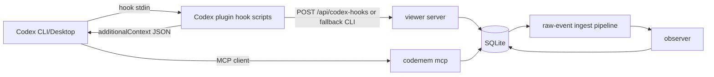

# Codex first-class integration plan

Related epic: `codemem-4pdj`

## Status

Draft implementation plan. Research completed against local Codex installs on 2026-05-28. Phase 0 smoke evidence was collected on 2026-05-29 for PATH CLI 0.135.0 and installed Desktop bundled CLI 0.133.0.

## Summary

Codex now has enough official extension surface to support codemem as a first-class integration target, not a shell-wrapper workaround. The target should be **Codex Desktop plus Codex CLI 0.135.0+**, with Desktop still treated as the priority validation runtime because its plugin hook feature flag is explicitly stable.

The integration should follow the existing adapter architecture:

- package codemem as a native Codex plugin and marketplace entry
- use Codex hooks for ingestion and prompt-time context injection
- expose `codemem mcp` through plugin-bundled MCP configuration
- normalize Codex hook payloads into the shared AdapterEvent v1 raw-event path
- avoid storage forks and generic shell shims

## Research findings

### Installed Codex runtimes

| Runtime | Binary | Version | Integration surface |
|---|---|---:|---|
| Homebrew `codex` cask CLI on PATH | `/opt/homebrew/bin/codex` | `0.135.0` | Full plugin lifecycle, marketplace lifecycle, hooks, MCP |
| Installed Codex Desktop bundled CLI | `/Applications/Codex.app/Contents/Resources/codex` | `0.133.0` | Full plugin lifecycle, marketplace lifecycle, hooks, plugin hooks, MCP |

The PATH CLI is installed by Homebrew cask `codex`, from `Homebrew/homebrew-cask/Casks/c/codex.rb`. Homebrew also exposes a separate `codex-app` cask for the Desktop app, but it is not installed on this machine. The local Desktop app reports `CFBundleShortVersionString=26.519.81530`; `brew info --cask codex-app` currently reports `26.519.41501`, so installing the app cask would be a different Desktop distribution channel and should be validated separately before release claims.

CLI 0.135.0 now exposes:

- `codex plugin add`
- `codex plugin list`
- `codex plugin remove`
- `codex plugin marketplace add/list/upgrade/remove`

This removes the earlier 0.130.0 blocker where PATH Codex only exposed marketplace commands.

### Feature flag caveat

Desktop 0.133.0 reports:

- `hooks`: stable, enabled
- `plugins`: stable, enabled
- `plugin_hooks`: stable, enabled

CLI 0.135.0 reports:

- `hooks`: stable, enabled
- `plugins`: stable, enabled
- `plugin_hooks`: removed, disabled

Running CLI 0.135.0 with `--enable plugin_hooks` still reports `plugin_hooks` as removed/disabled. Do not base CLI support on enabling that flag. The local smoke test proved installed plugin hooks execute through the normal `hooks`/`plugins` surfaces after hook trust is persisted, so `plugin_hooks` appears irrelevant for CLI 0.135.0 runtime behavior.

Because `codex` and `codex-app` are separate Homebrew casks, the compatibility matrix should track install channel, not just version number. A future validation pass should compare:

- Homebrew `codex` cask CLI
- installed/auto-updated Codex Desktop app
- Homebrew `codex-app` cask Desktop app, if users commonly install Desktop that way
- any official non-Homebrew installer path documented by OpenAI

### Marketplace and plugin packaging

Codex plugin manifests live under:

```text
.codex-plugin/plugin.json
```

Supported manifest fields include:

- `skills`
- `mcpServers`
- `apps`
- `hooks`
- `interface`

Codex marketplace roots use:

```text
.agents/plugins/marketplace.json
```

Marketplace sources can be added from:

- local path
- `owner/repo[@ref]`
- HTTPS Git URL
- SSH Git URL
- Git source plus sparse checkout paths

### Hook support

Codex supports these hook events:

- `SessionStart`
- `UserPromptSubmit`
- `PreToolUse`
- `PermissionRequest`
- `PostToolUse`
- `PreCompact`
- `PostCompact`
- `SubagentStart`
- `SubagentStop`
- `Stop`

Useful hook output fields include:

- `hookSpecificOutput.additionalContext` on `SessionStart`, `UserPromptSubmit`, `PreToolUse`, and `PostToolUse`
- `updatedInput` on `PreToolUse`
- `updatedMCPToolOutput` on `PostToolUse`
- block/stop decisions on relevant events

For codemem MVP, only context injection and ingestion are in scope. We should not use Codex hooks to mutate tool input/output in the first release.

Plugin hook commands receive plugin-root/data environment variables:

- `PLUGIN_ROOT`
- `PLUGIN_DATA`
- `CLAUDE_PLUGIN_ROOT` compatibility alias
- `CLAUDE_PLUGIN_DATA` compatibility alias

Codex hook input schemas are close to Claude hook payloads and include `session_id`, `turn_id`, `cwd`, `transcript_path`, `model`, `permission_mode`, and event-specific fields like `prompt`, `tool_name`, `tool_input`, `tool_response`, and `tool_use_id`.

### MCP support

Codex supports MCP client configuration for:

- stdio servers: `command`, `args`, `env`, `env_vars`, `cwd`
- streamable HTTP servers: `url`, `bearer_token_env_var`, `http_headers`, `env_http_headers`

Local Codex config already confirms `codemem` works as a stdio MCP server:

```text
codemem mcp
```

The Codex plugin should bundle `.mcp.json` so installation wires MCP automatically instead of requiring manual config edits.

For Codex plugin-bundled MCP files, use either a top-level server map or `mcpServers`. Do not use Claude-style `mcp_servers`; Codex treats that as a server name and the plugin detail surface reports no bundled MCP server.

### Phase 0 smoke results

A temporary local marketplace plugin under `.tmp/codex-smoke/marketplace` validated the core integration surfaces:

- PATH CLI `/opt/homebrew/bin/codex` 0.135.0 listed the installed plugin, discovered plugin hooks via `hooks/list`, executed `SessionStart` and `UserPromptSubmit` hooks in an app-server turn, and surfaced `additionalContext` entries in `hook/completed` notifications.
- Installed Desktop bundled CLI `/Applications/Codex.app/Contents/Resources/codex` 0.133.0 showed the same installed plugin hook discovery and execution behavior.
- Hook commands received `PLUGIN_ROOT`, `PLUGIN_DATA`, `CLAUDE_PLUGIN_ROOT`, and `CLAUDE_PLUGIN_DATA`.
- Hook trust must be satisfied for normal execution. `hooks/list` reports untrusted plugin hooks until matching `[hooks.state."..."]` trusted hashes are persisted in `config.toml`, or the runtime is launched with the dangerous bypass flag for vetted automation.
- `codex debug prompt-input` does not execute plugin hooks; app-server `thread/start` plus `turn/start` is the useful noninteractive smoke path.
- Plugin MCP metadata appeared in `plugin/read` and `mcpServerStatus/list` after changing `.mcp.json` from `mcp_servers` to a top-level server map. The smoke MCP stub intentionally failed handshake because it was not a real MCP server, but the bundled server declaration was discovered.

## Goals

- Ship codemem as a native Codex plugin marketplace package.
- Support Codex Desktop and Codex CLI 0.135.0+ when hook execution parity is proven.
- Capture Codex session lifecycle events into the shared raw-event queue.
- Inject memory packs automatically through Codex hook `additionalContext`.
- Expose codemem MCP tools through plugin-bundled MCP configuration.
- Reuse existing CLI, store, pack, observer, raw-event, and adapter-schema infrastructure.
- Document install, update, validation, and troubleshooting flows.

## Non-goals

- No shell-level wrapper integration.
- No generic bash/zsh/fish session hooks.
- No adapter-specific storage schema fork.
- No reliance on private Codex auth files or Desktop internals for MVP.
- No tool input/output mutation in Codex hooks for initial support.
- No support claim for Codex CLI versions earlier than 0.135.0.

## Proposed package layout

```text
plugins/codex/
  .codex-plugin/plugin.json
  .mcp.json
  hooks/hooks.json
  scripts/ingest-hook.mjs
  scripts/user-prompt-hook.mjs
  scripts/inject-context-hook.mjs
  skills/codemem/SKILL.md
```

Release/marketplace root:

```text
.agents/plugins/marketplace.json
```

The Phase 1 skeleton uses Codex's canonical repo/team marketplace location, `.agents/plugins/marketplace.json`, with a relative source path of `./plugins/codex`. Keep Claude marketplace metadata in `.claude-plugin/marketplace.json`; do not add a second Codex marketplace root unless a future Codex release requires it.

## Runtime architecture



## Hook scope

### MVP hook template

| Codex hook | Default registration | Purpose |
|---|---:|---|
| `SessionStart` | yes | capture session start, project/cwd metadata |
| `UserPromptSubmit` | yes | capture prompt and return memory-pack `additionalContext` |
| `PostToolUse` | yes | capture tool result and working-set signals |
| `Stop` | yes | capture final assistant text when available and optionally boundary flush |

### Deferred hooks

| Codex hook | Reason to defer |
|---|---|
| `PreToolUse` | Useful for tool-call capture, but default ingestion can start with `PostToolUse`; avoid extra latency and policy risk in MVP. |
| `PermissionRequest` | Not needed for memory capture/injection. |
| `PreCompact` / `PostCompact` | Useful later for compaction-aware summaries, not required for first-class MVP. |
| `SubagentStart` / `SubagentStop` | Useful later for multi-agent provenance; defer until base session support is stable. |

## Adapter mapping

Add `packages/core/src/codex-hooks.ts` with the same shape as `claude-hooks.ts`, but with Codex-native source naming.

Initial mapping:

| Codex hook | AdapterEvent v1 | Payload mapping |
|---|---|---|
| `SessionStart` | `session_start` | `payload.source`, `cwd`, `model`, `permission_mode` |
| `UserPromptSubmit` | `prompt` | `payload.text <- prompt` |
| `PreToolUse` | `tool_call` | `payload.tool_name`, `payload.tool_input`, `meta.tool_use_id` |
| `PostToolUse` | `tool_result` | `payload.tool_name`, `payload.tool_input`, `payload.tool_output <- tool_response`, `status: ok`, `meta.tool_use_id` |
| `Stop` | `assistant` | `payload.text <- last_assistant_message` or latest transcript assistant text |

Event identity:

- Prefer Codex `turn_id` and `tool_use_id` when available.
- Generate deterministic `event_id` from `(session_id, hook_event_name, turn_id?, tool_use_id?, timestamp?, content hash)`.
- Set `ordering_confidence=low` unless Codex exposes a monotonic sequence later.

Project resolution:

1. `CODEMEM_PROJECT`
2. repo/cwd-derived project name
3. payload project field if Codex adds one later
4. path hints from `tool_input`, `transcript_path`, or cwd

## CLI commands

Add Codex equivalents to Claude hook commands:

- `codemem codex-hook-ingest`
- `codemem codex-hook-inject`
- optional later: `codemem codex-hook-plugin-log`

The first implementation can share lower-level helpers with Claude where naming-neutral helpers exist. Avoid exposing Claude-specific command names from Codex plugin scripts.

Expected behavior:

- Hook scripts read one JSON payload from stdin.
- Ingestion is non-fatal to Codex sessions.
- `UserPromptSubmit` sends ingestion in the background and returns `additionalContext` JSON on stdout.
- Local pack generation is preferred; HTTP `/api/pack` fallback remains optional.
- Direct local raw-event enqueue is the fallback when viewer HTTP is unavailable.

## Validation strategy

### Required smoke tests before implementation claim

1. Create a minimal local Codex marketplace plugin outside the repo.
2. Install it with Desktop-bundled CLI and PATH CLI 0.135.0.
3. Register a `UserPromptSubmit` hook that returns static `additionalContext`.
4. Confirm the text appears in model-visible context for both runtimes.
5. Confirm plugin hook scripts receive `PLUGIN_ROOT` and `PLUGIN_DATA`.
6. Confirm `codex plugin list` and Desktop UI/app-server surfaces show bundled hooks and MCP servers.
7. Run the same test with `--enable plugin_hooks` on CLI 0.135.0 only to verify that the removed flag is irrelevant.
8. If practical, repeat the Desktop smoke test against the Homebrew `codex-app` cask channel or document why the installed Desktop app is the only supported Desktop channel for the release.

### Repository tests

- Unit tests for Codex hook payload mapping.
- Unit tests for Codex injection JSON output schema.
- Tests for project resolution and deterministic event ID generation.
- CLI command tests for `codex-hook-ingest` and `codex-hook-inject`.
- Plugin manifest/marketplace smoke test that validates packaged paths are relative and portable.

### Manual dogfood gate

For Desktop and CLI 0.135.0+:

1. Add local marketplace.
2. Install `codemem` plugin.
3. Start a Codex session in this repo.
4. Ask a prompt that should retrieve an existing memory.
5. Confirm injection occurred.
6. Run at least one file-read/tool action.
7. Confirm raw events are queued and flushed.
8. Confirm `codemem recent` shows Codex-derived memories after observer processing.
9. Confirm MCP tools are available in Codex.

## Documentation updates required

- `README.md`: add Codex install/support section once validated.
- `docs/plugin-reference.md`: add Codex marketplace install, hooks, MCP, and troubleshooting.
- `docs/architecture.md`: update support matrix from experimental to partial/supported after gates pass.
- `docs/versioning.md`: include Codex marketplace/plugin version pinning once release automation is wired.

## Rollout plan

### Phase 0: proof of hook parity

Validate installed plugin hook execution across Desktop and CLI 0.135.0+. This phase should not touch production plugin packaging beyond temporary local smoke fixtures.

Exit criteria:

- Desktop executes installed plugin hooks. **Passed locally for installed Desktop bundled CLI 0.133.0.**
- CLI 0.135.0+ executes installed plugin hooks despite `plugin_hooks` being removed/disabled. **Passed locally for Homebrew `codex` cask CLI 0.135.0.**
- `additionalContext` is accepted from `UserPromptSubmit`. **Passed locally via app-server `hook/completed` context entries.**
- Plugin-bundled MCP server declarations load. **Passed locally after using Codex-compatible `.mcp.json`; the temporary stub server failed handshake by design.**

### Phase 1: Codex plugin package skeleton

Add the Codex plugin bundle and marketplace metadata with inert/smoke hook scripts.

Implemented skeleton files:

- `.agents/plugins/marketplace.json`
- `plugins/codex/.codex-plugin/plugin.json`
- `plugins/codex/.mcp.json`
- `plugins/codex/hooks/hooks.json`
- `plugins/codex/scripts/*.mjs`
- `plugins/codex/skills/codemem/SKILL.md`

Exit criteria:

- `codex plugin marketplace add <local repo>` can discover the plugin. **Passed locally with isolated `CODEX_HOME`.**
- `codex plugin add codemem@<marketplace>` installs the plugin. **Passed locally for `codemem@codemem`.**
- `codex plugin list` shows the plugin installed/enabled. **Passed locally for version `0.34.0`.**
- Plugin paths contain no local absolute paths or secrets. **Checked skeleton metadata/scripts.**

### Phase 2: Codex hook ingestion

Add `codex-hooks.ts`, `codex-hook-ingest`, route support if needed, and tests.

Exit criteria:

- `SessionStart`, `UserPromptSubmit`, `PostToolUse`, and `Stop` map into AdapterEvent v1.
- Raw events enqueue through the shared queue.
- Observer processing produces useful memories from Codex sessions.

### Phase 3: prompt-time injection

Add `codex-hook-inject` and wire `UserPromptSubmit` to return `additionalContext`.

Exit criteria:

- Memory pack injection works in Desktop and CLI.
- Injection respects existing env controls: `CODEMEM_INJECT_CONTEXT`, `CODEMEM_INJECT_LIMIT`, `CODEMEM_INJECT_TOKEN_BUDGET`, `CODEMEM_INJECT_MAX_CHARS`.
- Hook failures continue Codex sessions without blocking user work.

### Phase 4: MCP and install polish

Bundle `.mcp.json`, skills, user-facing install docs, and compatibility guidance.

Exit criteria:

- Codex install gives users memory tools and automatic context without manual config edits.
- Docs include install, update, uninstall, validation, and troubleshooting.
- Release-version workflow keeps Codex plugin metadata in sync.

### Phase 5: support tier promotion

Promote Codex support only after Desktop and CLI 0.135.0+ pass repeatable dogfood gates.

Exit criteria:

- Targeted tests pass.
- Manual dogfood matrix passes.
- Architecture support matrix updated.
- Known gaps are documented.

## Risks and mitigations

| Risk | Impact | Mitigation |
|---|---|---|
| CLI `plugin_hooks` flag is removed | CLI may not execute plugin-bundled hooks | Phase 0 smoke passed on CLI 0.135.0; keep this in support-matrix notes but do not require the removed flag. |
| Codex plugin schema shifts | Install/runtime breakage | Keep plugin bundle minimal and test against Desktop plus latest CLI. |
| Homebrew CLI/Desktop channels differ | Support claims become misleading | Track `codex` cask, `codex-app` cask, and direct Desktop installs separately in validation. |
| Hook latency hurts prompt submit | Bad UX | Keep ingestion backgrounded; local pack only does bounded retrieval. |
| Hook stdout contamination | Invalid Codex hook output | Ensure scripts write only JSON to stdout; logs go to stderr/file. |
| Duplicate memories from multiple runtimes | Noise | Preserve source-specific event IDs and shared project normalization. |
| Marketplace path ambiguity | Install failure | Validate final marketplace root and document exact command. |

## Open questions

- Does the Homebrew `codex-app` Desktop cask behave like the installed Desktop app channel?
- Should the public Codex marketplace file live at `.agents/plugins/marketplace.json`, `.codex-plugin/marketplace.json`, or both?
- Should Codex share the Claude hook script implementation internally, or should shared logic move into shell-neutral helper commands first?
- Does Codex expose enough assistant text in `Stop`, or should transcript parsing be the primary assistant capture path?
- Do Desktop UI plugin surfaces require additional `interface` assets before the integration feels first-class?

## Bead breakdown draft

Epic: `codemem-4pdj` — Codex first-class integration.

| Bead | Slice | Depends on |
|---|---|---|
| `codemem-4pdj.1` | Codex hook parity smoke test | none |
| `codemem-4pdj.2` | Codex plugin marketplace skeleton | `codemem-4pdj.1` |
| `codemem-4pdj.3` | Codex hook mapper and ingest command | `codemem-4pdj.1` |
| `codemem-4pdj.4` | Codex prompt-time memory injection | `codemem-4pdj.2`, `codemem-4pdj.3` |
| `codemem-4pdj.5` | Codex MCP packaging and install docs | `codemem-4pdj.2`, `codemem-4pdj.4` |
| `codemem-4pdj.6` | Codex plugin versioning and release metadata | `codemem-4pdj.2` |
| `codemem-4pdj.7` | Codex support-tier validation and promotion | `codemem-4pdj.5`, `codemem-4pdj.6` |

## References

- `docs/architecture.md`
- `docs/plugin-reference.md`
- `docs/plans/2026-03-02-multi-agent-adapter-architecture-design.md`
- Codex CLI 0.135.0 local help and feature flags
- Codex Desktop bundled CLI 0.133.0 local help and feature flags
