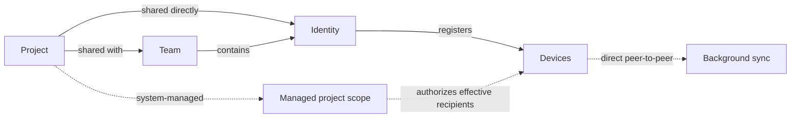

# Project-recipient sharing and identity design

**Date:** 2026-07-21
**Status:** Approved
**Related:** `2026-07-20-project-first-teammate-sharing-design.md`, `2026-04-30-sharing-domain-scope-design.md`, `2026-05-25-access-management-ia-design.md`

## Decision summary

Codemem will present sharing as relationships between Projects and recipients:

> Share these Projects with these Teams or Identities. Their authorized devices receive the Projects automatically, and sync runs in the background.

Projects remain the unit users choose to share. Teams and Identities are the recipients. Devices inherit access through exactly one Identity per runtime. Managed replication scopes remain the hard security boundary, but Codemem creates and reconciles them as system-owned infrastructure instead of asking users to assign Spaces, grants, actors, filters, and trust state manually.

The primary navigation becomes:

```text
Feed     Projects     Sharing     Devices     Health
```

`Sync` stops being a top-level administrative concept. Users see sharing intent, device availability, and plain-language progress. Scope, grant, trust, coordinator, and replication details move to an explicit advanced administration surface.

This design supersedes the user-facing Team/Space-first workflow in older plans. It preserves the authorization, exact-project, canonical-identity, local-first, and fail-closed invariants in the scope and project-first sharing designs.

## Problem

The current UI requires users to reconstruct a graph of Projects, Spaces, Teams, People, devices, grants, trust, filters, and sync state. It exposes several implementation layers as if each were an independent task:

- assigning a Project to a Space;
- enrolling a device in a Team;
- granting that device Space access;
- creating or assigning a Person;
- establishing device trust;
- configuring project filters;
- interpreting per-Space replication status.

The product also has two invitations with incompatible semantics. A project invitation grants reviewed project access and starts sync. A Team invitation may only enroll a device for discovery and administration, leaving it with no data access. A user reasonably expects accepting a Team invitation to provide the Team's shared content.

The backend separation is valuable, but the interface makes users operate it directly. The result is both confusing and dangerous: controls that can move or expose thousands of memories compete visually with the intended sharing action.

## Design principles

1. **Intent is the source of truth.** Users specify which Projects go to which Teams or Identities.
2. **Projects are the sharing unit.** Display names never substitute for canonical project identity.
3. **Recipients inherit access.** Team members and Identity devices receive the Projects granted to their parent recipient.
4. **One Identity per runtime.** Personal and Work are separate security contexts even when one human uses both.
5. **Scopes are system-owned.** They remain real authorization boundaries but are absent from normal workflows.
6. **Sync is a result.** Users do not administer the replication engine to perform ordinary sharing.
7. **Review must resolve.** Nothing enters a review queue without concrete decisions, previews, and a durable completion state.
8. **Every incomplete state is legible.** It names what is happening, who must act, and the one next action when action is required.
9. **Ambiguity under-shares.** Migration and reconciliation fail closed instead of guessing.
10. **Bulk workflows are first-class.** Project-first must not mean project-by-project administration.

## User-facing concepts

| Concept | Meaning |
| --- | --- |
| Project | The exact unit a user shares. |
| Identity | One personal, work, or other security context. An Identity may later be verified by OAuth/OIDC. |
| Team | A durable group of Identities that receives explicitly shared Projects. |
| Device | One Codemem runtime registered to exactly one Identity. |

The normal UI does not require users to understand Space, scope, grant, actor, peer, membership epoch, fingerprint, replication cursor, or coordinator group.

## Conceptual model



Example:

```text
Project: example-oss
├── Personal Identity
│   ├── Home laptop
│   └── Personal server
├── Work Identity
│   └── Work laptop
└── Open Source Team
    ├── Contributor A
    └── Contributor B
```

The explicit Personal-to-Work share allows an OSS Project to reach a Work Identity without exposing unrelated private Projects. Being the same biological person is not an authorization shortcut.

## Access inheritance

### Identity inheritance

A new device registered to an Identity inherits the Projects available to that Identity through:

- direct Project-to-Identity relationships; and
- the Identity's Team memberships.

It does not inherit Projects belonging to another Identity owned by the same human.

### Team inheritance

When a Project is shared with a Team:

- all current Team member Identities receive it;
- all future Team member Identities inherit it;
- each member's registered devices receive it; and
- unrelated Projects remain excluded.

Accepting a Team invitation means accepting the Team relationship and its current and future shared Projects. The acceptance screen must summarize that consequence before confirmation.

### Direct Identity access

A Project may be shared directly with an Identity without creating Team membership. This is guest or one-off access and can be managed independently from Team access.

## Product surfaces

### Projects: what is shared

Projects is the primary sharing surface. It shows:

- canonical Project groups with concise memory counts;
- recipient chips for Teams and Identities;
- one plain-language status;
- multi-select and `Share selected`;
- a separate, actionable `Projects needing review` queue.

Normal Project rows do not show Space selectors, bulk scope reassignment, raw canonical identity warnings, or path-level migration controls.

```text
Projects                                      12 selected

[x] example-oss       Shared with Open Source Team, Work Identity
[x] docs-site         Shared with Open Source Team
[ ] private-notes     Personal Identity only

[ Share selected… ]
```

Project detail answers both directions:

- Who receives this Project?
- What is its current delivery status?

### Sharing: who receives Projects

Sharing contains three primary views:

```text
[ Teams ] [ Identities ] [ Invitations ]
```

A Team detail shows:

- member Identities;
- registered device count;
- all shared Projects;
- `Invite member`;
- `Add projects` and `Manage projects` bulk actions.

An Identity detail shows:

- verification state (`Local identity` until authenticated);
- registered devices;
- Team memberships;
- directly shared Projects;
- bulk project management.

### Devices: where Codemem runs

Devices shows the current Identity and its registered runtimes. A row answers:

- Is this device online?
- Is it up to date?
- How many Projects does it inherit?
- Does the user need to act?

Trust direction, addresses, fingerprints, Space counts, and per-scope progress remain in advanced diagnostics.

### Health: system condition

Health retains operational information such as maintenance, indexing, queue health, and service availability. It does not become another sharing administration surface.

### Advanced administration

Advanced administration contains:

- managed scopes and raw grants;
- coordinator configuration;
- trust keys and network addresses;
- canonical project identity repair;
- narrowing filters;
- membership epochs;
- replication cursors and attempts;
- legacy compatibility controls.

Entering this area should be a deliberate escalation, not part of ordinary sharing.

## Sharing Projects

Users may begin from a Project or a recipient. Both views edit the same durable sharing relationships.

### Project-first bulk flow

```text
Select Projects
      ↓
Choose Teams and Identities
      ↓
Review Projects, memories, current members, and future inheritance
      ↓
Confirm
      ↓
Provision access and start sync
```

Review example:

```text
Share 12 Projects with Open Source Team

• 18,420 existing memories
• Future memories from these Projects
• Available to 5 current member Identities
• Future Team members will inherit access

No other Projects are affected.
```

### Recipient-first bulk flow

From Team or Identity detail, users can search, select, add, or remove many Projects in one operation. This makes Approach 1 scalable without requiring one dialog per Project.

Optional automatic rules based on GitHub organization, path, or tags are deferred. When added, they must be opt-in and preview-first by default; `all Projects` is never an implicit rule.

## Invitations

### Team invitation

```text
Team → Invite member
     → enter name or future verified address
     → review inherited Projects and memory count
     → create invitation
     → recipient accepts Team membership on one Identity/device
     → current Team Projects become available
     → future Team Projects inherit automatically
```

Acceptance states plainly that joining the Team includes current shared Projects and Projects shared with the Team later.

### Direct Project invitation

A direct invitation pins the reviewed canonical Project set. The recipient cannot add or replace Projects during acceptance. Acceptance creates or links the recipient Identity, binds one accepting device and public key, provisions exact Project access, and starts sync.

### Add-device invitation

An add-device invitation binds one runtime to exactly one Identity. Before acceptance, it previews all direct and Team access that the device will inherit and explicitly states what it will not receive.

## Lifecycle language

Every operation answers:

1. What is happening?
2. Is anything blocked?
3. Who must act?
4. What is the one next action?

| Status | Meaning | Primary action |
| --- | --- | --- |
| Waiting for acceptance | The recipient has not accepted. | Copy invite |
| Setting up access | Policy and authorization are being reconciled. | None |
| Starting first sync | Initial replication is running. | None |
| Waiting for device | Access is ready, but a required device is offline. | None |
| Up to date | Expected Projects are available. | None |
| Needs attention | A specific repairable step failed. | One contextual retry or repair action |
| Access removed | Future replication is disabled; delivered copies may remain. | Share again, when applicable |

Offline is a waiting state, not an error. Technical traces live in diagnostics.

## Actionable review contract

Nothing may enter `Needs review` unless the server can provide:

1. what Codemem found;
2. why it cannot decide safely;
3. a recommended decision;
4. every other valid decision;
5. a preview of the effect of each choice; and
6. a durable completion state that clears the item.

Valid outcomes include:

- apply the recommendation;
- choose different recipients or grouping;
- preserve current access exactly;
- keep the Project local;
- keep identities separate;
- attach a device to an Identity;
- create a different Identity;
- remove a stale device; and
- keep the current setup unchanged.

`Reject suggestion` and `Keep current setup unchanged` are durable decisions. The item stays cleared until its underlying state fingerprint changes. Repeated items support bulk resolution.

If no local decision can resolve a problem, the state is `Blocked`, names who or what must act, and links to the actual repair action. Raw ambiguity without valid decisions is diagnostic information, not a user review item.

## Authority and reconciliation

The durable user-intent graph contains:

```text
ProjectRecipient(Project, Identity | Team)
IdentityDevice(Identity, Device)
TeamMembership(Team, Identity)
```

Effective device authorization is derived:

```text
direct Identity recipients → Identity devices
Team recipients → member Identities → Identity devices
```

Each canonical shared Project retains one managed Project scope. A reconciler compares desired effective devices with current scope membership:

```text
desired − current → grant
current − desired → revoke
```

Reconciliation is persisted, idempotent, resumable, immediately refreshes local authorization, and fails closed. A failure may delay sharing but cannot broaden it.

Device trust and connectivity do not grant Project access. Project filters may narrow access but never expand it. The coordinator manages invitations, identity/team membership, scope authority, and discovery; memory payloads continue to move directly between peers.

## Authentication evolution

V1 uses a local Identity plus device-key proof. A manually named Identity is an unverified placeholder, not proof of a human's identity.

Future OAuth/OIDC maps a verified account to the same Identity abstraction:

```text
OIDC account → verifies Identity → registers devices
```

Personal and Work logins remain separate Identities. OAuth strengthens verification without changing Project-recipient relationships or collapsing identities that belong to the same human.

## Migration

Migration preserves existing enforcement and never infers broader access from proximity.

| Existing state | Migration behavior |
| --- | --- |
| Managed exact-Project scope | Convert to Project-recipient relationships. |
| Personal scope with one clear Identity | Suggest attaching Projects to that Identity. |
| Team scope with unambiguous membership | Suggest Team recipients with an exact preview. |
| Mixed or ambiguous Space | Preserve current access and require actionable review. |
| Unassigned device | Preserve it and require an Identity decision. |
| Legacy project filters | Keep only as narrowing compatibility rules. |

Migration phases:

1. **Read-only projection** — render the new Projects, Sharing, and Devices views over current state without changing authorization.
2. **Policy migration** — create Identity, Team-membership, and Project-recipient records; require decisions for ambiguity.
3. **Policy authority** — make recipient relationships authoritative and reconcile managed scope membership.
4. **Legacy demotion** — move old controls to Advanced after policy parity and exactness are proven.
5. **Deferred automation** — add verified identities and preview-first GitHub organization/path/tag rules later.

Existing scopes continue enforcing access during migration. Existing multi-Project Spaces are not silently split or reinterpreted. Exact Project movement uses the existing idempotent `reassign_scope` contract where required.

## Security invariants

- `scope_id` remains the hard replication authorization boundary.
- Canonical Project identity, never display name or basename, defines sharing intent.
- Selecting one Project cannot expose a sibling or similarly named Project.
- Team membership grants only Projects explicitly shared with that Team.
- Identity registration grants only Projects available to that Identity.
- Connectivity, coordinator enrollment, and device trust never imply data access.
- Filters and visibility gates only narrow eligible data.
- Invite acceptance is single-use and bound to the reviewed relationship and accepting device/key.
- Recipient-controlled input cannot broaden persisted Project intent.
- Revocation blocks future replication but does not claim to erase delivered copies.
- Ambiguous migration under-shares and preserves existing enforcement until resolved.
- Unsupported older peers fail closed before partial history migration.

## Validation strategy

### Model and API tests

- Team recipient expansion to current member Identities and devices;
- future member inheritance;
- Identity recipient expansion to newly registered devices;
- Personal and Work Identity isolation;
- explicit cross-Identity OSS sharing;
- direct Identity access without Team membership;
- bulk Project-recipient changes with exact previews;
- durable accept, reject, and keep-current review outcomes;
- actionable review fingerprint invalidation only when state changes;
- idempotent reconciliation and retry;
- fail-closed ambiguous and unsupported states.

### UI tests

- Projects shows recipients without Space/scope controls;
- Sharing supports recipient-first bulk management;
- Team invitation previews current Projects and future inheritance;
- add-device invitation previews inherited access and exclusions;
- Devices presents availability and status without raw trust/grant terminology;
- every `Needs review` item has valid decisions and clears after one is chosen;
- `Blocked` states identify the actor and route to a real repair action;
- primary flows contain no raw IDs, scopes, grants, filters, addresses, epochs, or cursors.

### End-to-end tests

1. Share many exact Projects with one Team and verify unrelated Projects remain absent.
2. Add a future Team member and verify inherited existing and future memories.
3. Register a new device to one Identity and verify only that Identity's access appears.
4. Keep Personal and Work Identities isolated, then explicitly share one OSS Project across them.
5. Share directly with an Identity and verify no Team membership is created.
6. Remove Team, Identity, and Project relationships and verify future replication stops.
7. Exercise offline, retry, and old-peer capability paths without duplicate grants or partial broadening.
8. Migrate ambiguous legacy state and prove no decision broadens access without confirmation.

## V1 scope

V1 includes:

- one Identity per runtime;
- Project recipients of Team or Identity;
- Team and Identity inheritance;
- bulk sharing in both directions;
- Team and device invitation previews;
- new primary navigation and surface ownership;
- system-managed scopes and reconciliation;
- actionable migration review;
- legacy controls retained under Advanced.

Deferred:

- OAuth/OIDC verification;
- multiple Identities in one runtime;
- GitHub organization, path, or tag rules;
- device profiles and automatic classifications;
- remote deletion of delivered memories;
- replacing direct peer-to-peer memory transport.

## Acceptance criteria

- A user can explain the model as: Projects are shared; Identities use devices; Teams contain Identities; sync happens automatically.
- A user can share dozens of Projects with a Team in one reviewed operation.
- Project and recipient views show the same sharing relationships from both directions.
- A Team invitation clearly describes current and future inherited Projects.
- An add-device invitation clearly describes inherited access and exclusions.
- Personal and Work Identities remain isolated unless a Project is explicitly shared across them.
- Every review item offers valid decisions, including a durable `Keep current setup unchanged` outcome.
- Normal workflows never require Space, scope, grant, actor, peer, membership epoch, or replication cursor terminology.
- Exact canonical Project isolation, idempotency, and fail-closed behavior remain proven end to end.

## Non-goals

- Removing replication scopes from the data or protocol model.
- Treating Team enrollment, trust, or network reachability as implicit data access.
- Guessing recipient policy from ambiguous existing Spaces.
- Recalling data already delivered to a previously authorized device.
- Making the coordinator a memory data path.
- Solving enterprise authentication in the first implementation.
