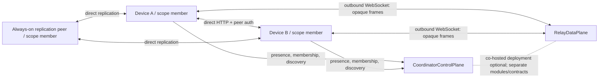
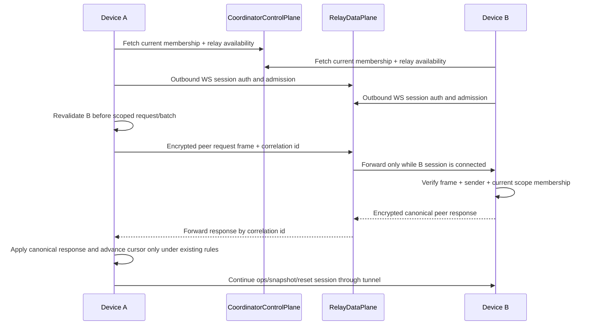

# Relay-Assisted Sync Design

**Date:** 2026-08-08
**Status:** Proposed — review required before implementation
**Related:** `2026-08-09-remote-workspace-connectivity-evidence-design.md`, `2026-08-09-remote-workspace-connectivity-evidence-report.md`, `2026-04-30-seed-and-mesh-architecture-converged.md`, `2026-04-30-sharing-domain-scope-design.md`, `2026-05-25-scoped-sync-protocol.md`, `2026-01-24-p2p-sync-phase-1.md`, `2026-01-24-p2p-sync-phase-2.md`, `2026-03-08-identity-aware-sync-shared-memory-foundation.md`, `2026-03-12-coordinator-backed-cross-network-discovery.md`, `2026-03-12-optional-relay-coordinator-mode.md`, `2026-03-12-relay-and-buffered-delivery-follow-on.md`, `2026-07-21-project-recipient-sharing-identity-design.md`, `../architecture.md`

## Executive summary

Codemem remains local-first and direct-peer-first. This proposal adds an **optional, live-only opaque relay** for the cases where authorized devices are simultaneously online but cannot directly connect.

One default coordinator deployment may co-host a `RelayDataPlane` beside `CoordinatorControlPlane`. They must remain separable by module, protocol, storage, and configuration so a relay can later run independently without changing the peer sync protocol.

The first relay is intended to forward bounded, end-to-end-protected frames over outbound WebSockets, contingent on approval of the cryptographic envelope. It provides a live bidirectional tunnel for the peer sync mechanisms implemented today: scoped cursor negotiation, `/v1/ops`, reset responses, and paginated snapshots can cross the tunnel while both peers are connected. It does not persist payloads, inspect memory semantics, grant scope access, replace replication peers, or become the source of truth. Correctness remains with the canonical scoped op-log, per-scope cursors, snapshot/reset state, idempotent apply, tombstones, and transactional apply semantics. Future anti-entropy may reuse the tunnel but is not an initial dependency.

No production implementation is authorized by this proposal.

## Supersedes and refines

If approved, this document supersedes **Invariant 4** in `2026-04-30-seed-and-mesh-architecture-converged.md` and its mirror in `2026-04-30-sharing-domain-scope-design.md`. The replacement wording is:

> **Coordinator control is not a data path.** Discovery, presence, invitations, and membership authority do not store, decode, authorize, or proxy memory payloads. A coordinator deployment MAY co-host an optional, logically separate RelayDataPlane that forwards opaque live peer-session frames. The relay is not required for sync, grants no data access, owns no canonical state, and must be deployable separately without changing the peer protocol.

Both older invariant lists are updated with this wording and link back to this document. The refined wording describes a permitted architecture boundary only; it authorizes no relay implementation. Relay production work remains blocked on `codemem-zjvr.1.5`, including its recipient-bound-signature prerequisite `codemem-zjvr.1.10`.

This document also supersedes `2026-03-12-optional-relay-coordinator-mode.md` where that design proposed relay-group authorization or initial durable plaintext/readable queueing. Authorization is anchored on `scope_id`, and the initial relay is live-only. It advances the trigger criteria in `2026-03-12-relay-and-buffered-delivery-follow-on.md` but requires evidence that fresh coordinator discovery still leaves a material direct-reachability gap before implementation approval.

## Context and current state

The accepted mesh architecture deliberately deferred relay support and stated that the coordinator was never a data path. That was correct for the original coordinator-only scope: the coordinator must not store, proxy, or interpret memory payloads.

This proposal **refines**, rather than silently ignores, that invariant:

> The **CoordinatorControlPlane** is never a memory data path. An optional, separately bounded **RelayDataPlane** may forward opaque, end-to-end-protected frames. It has no memory-store, authorization, merge, retrieval, or payload-semantic role.

Direct replication remains the primary topology. Ordinary always-on peers remain the availability backstop because they are authorized members of the relevant scopes and hold replicated data. They are not interchangeable with a relay: a non-member relay forwards opaque frames but must not read, retain, or originate scope content.

The existing sync foundation already defines the properties a relay must preserve:

- append-only replication ops, tombstones, Lamport/LWW ordering, and idempotent apply;
- direct HTTP peer sync authenticated with Ed25519-signed requests and pinned device keys, with cursor and snapshot recovery;
- `scope_id` as the hard authorization boundary once enforcement is active;
- membership epochs, revocation of future delivery, and local-only scopes that never leave their minting device;
- project filters and visibility as narrowing gates only; and
- coordinator-backed discovery and presence as control-plane functions.

Direct peer sync is not currently mTLS and does not provide transport or application-layer confidentiality by default. Relay encryption must therefore use a transport-neutral crypto seam that can later protect direct sync rather than creating a relay-only security stack.

Legacy and downgraded peer sessions remain part of the direct-sync compatibility surface. Relay is stricter: it MUST require a negotiated `scoped` capability and MUST reject legacy, unscoped, or capability-downgraded streams. The constrained legacy direct-compatibility path never crosses relay transport.

WebSocket is therefore an acceleration and reachability mechanism, not a new consistency lane or an alternative authority.

## Goals

- Preserve direct peer sync and relay-free operation as first-class supported modes.
- Provide a complete live peer-sync path for two simultaneously connected, authorized devices that cannot establish a direct path, including bootstrap and divergence repair.
- Allow co-hosted coordinator and relay deployment without coupling their runtime contracts.
- Keep relay frames opaque to the relay, contingent on a cryptographic-envelope design review and approved key-agreement mechanism.
- Preserve scoped authorization and current replication correctness semantics unchanged.
- Bound metadata exposure, resource use, and abuse potential.
- Make fallback, degradation, and diagnostics explicit.

## Non-goals

- Durable store-and-forward in the initial relay.
- Hosted plaintext payload storage, now or by default.
- A relay-granted authorization model, implicit scope access, or group-membership-as-access.
- Replacing direct `/v1/ops` and `/v1/snapshot` reconciliation, cursor/reset recovery, or member-peer backstops.
- Server-side merge, search, retrieval, op-log ownership, or canonical memory state.
- STUN/ICE hole punching, direct-path establishment assistance, TURN protocol compatibility, or a generic public relay pool. The proposed relay addresses NAT- and firewall-blocked reachability by accepting outbound-only connections from both peers; it does not create a direct path.
- Resolving the exact E2E envelope, key agreement, rekeying, or membership-key lifecycle in this proposal.

## Considered alternatives and tradeoffs

| Alternative | Decision | Tradeoff |
| --- | --- | --- |
| Direct peers only | Retain as default, insufficient alone | Simplest and most private; fails when authorized peers cannot dial each other. |
| Always-on member peer | Recommended availability backstop | Reads and persists scope data by design because it is a member; requires a trusted member deployment. |
| Coordinator proxies raw sync payloads | Rejected | Collapses control and data roles, expands coordinator trust, and violates the refined invariant. |
| Live opaque peer-session tunnel | Proposed first slice | Restores simultaneous reachability and carries canonical bootstrap/reconciliation without durable payload custody; does not solve offline delivery. |
| Durable encrypted relay queue | Deferred | Requires a separate, reviewed encryption and key-lifecycle design, especially for revocation and expiry. |
| Hosted plaintext durable queue | Rejected as default | Incompatible with the intended trust boundary. A trusted self-hosted plaintext option is a later explicit decision. |
| New mesh stack/libp2p | Rejected | Adds a transport ecosystem without changing op-log correctness requirements. |

## Proposed architecture

### Deployment and trust boundaries

`CoordinatorControlPlane` authenticates and publishes enrollment, presence, membership manifests, and an optional relay endpoint hint. Peers independently pin the relay identity; a coordinator-published pointer is not sufficient trust. `RelayDataPlane` authenticates a device session only enough to admit and route it; it does not decide whether a device may receive an op. Peers make that decision with current scope membership before sending and before applying.

### Required seams for standalone relay

| Seam | Required boundary |
| --- | --- |
| Module | Separate `coordinator-control` and `relay-data-plane` packages/services, with no import of memory-store, op decoding, or merge logic into relay code. |
| Protocol | Versioned relay session/frame contract distinct from coordinator admin/discovery APIs and peer `/v1/ops`/`/v1/snapshot` APIs. |
| Storage | The initial relay has no payload persistence. Its connection/session registry and rate-limit state are ephemeral and independently owned; it is not a source of truth for coordinator presence. Any later durable-delivery service requires a separate approved design and storage contract. Control-plane membership/audit storage remains separate. |
| Configuration | Independent enablement, URL, identity pin, limits, and observability settings. A peer can use coordinator discovery without relay, or a standalone relay with compatible control-plane-issued admission material. |
| Crypto | Relay envelope and key-agreement code is transport-neutral and reusable by direct peer sync; the relay envelope does not replace canonical peer signatures or recipient binding. |
| Deployment | Co-hosting is an operational default, never a protocol assumption; distinct origins/processes and scaling policies must be possible. |

### Roles

| Role | Trust and responsibility |
| --- | --- |
| Device peer | Holds local SQLite state; validates scope membership; encrypts/protects frames; applies ops transactionally. |
| Always-on replication peer | An ordinary authorized member; may read and retain scope data, exchange cursor-based operations, bootstrap, and serve snapshots. |
| Coordinator control plane | Publishes discovery/membership authority and diagnostics; never reads or owns relay payload semantics. |
| Relay data plane | Opaque live transport only; routes bounded envelopes among connected sessions; has no data-access grant. |
| Operator | Chooses relay deployment and limits; cannot represent relay enablement as a sharing grant. |

## Connection and path selection

For each authorized target peer and scope, the daemon selects paths in this order:

1. direct LAN (mDNS);
2. last-known, manual, or Tailscale address;
3. configured coordinator-hosted or standalone relay;
4. offline wait and normal later reconciliation.

Separately, normal mesh scheduling continues to synchronize with reachable authorized members, including always-on peers that already hold the scope. Those peers improve availability and can later serve a target directly, but they are not an application-layer route to that target. This proposal does not add third-party forwarding or hinted handoff through arbitrary members; that remains separate work governed by the sharing-domain handoff rules. A relay tunnels a named sender-to-named-recipient peer session only.

Path choice is transport selection only. It does **not** grant a device membership in a `scope_id`, expand project filters, bypass visibility, or turn coordinator enrollment into data access.

## Live relay flow

The relay tunnels the existing bidirectional peer protocol rather than inventing a push-only delivery lane. Encrypted frames carry correlated peer requests and responses for scoped operations, cursor negotiation, reset boundaries, and paginated snapshots. The tunnel adds multiplexing, correlation identifiers, flow control, and bounded backpressure, but no new cursor or merge semantics. Future anti-entropy requests may use the same tunnel after that protocol exists.

The relay must drop, rather than queue, a frame when the target session is absent or its short live-delivery window expires. Sender retry is bounded and falls back to the normal sync scheduler. A `relay_forward_ack` means only that the relay accepted a frame for a currently connected target and MUST NOT advance a cursor, snapshot baseline, retained floor, or replication status. Only an authenticated canonical peer response processed by the existing sync protocol may advance cursor state. Relay transport acknowledgements never influence retention or prune-floor computation; canonical peer responses do, regardless of which transport carried them.

## Failure and recovery behavior

| Condition | Required behavior |
| --- | --- |
| Direct dial succeeds | Use direct peer sync; relay is idle. |
| Relay unavailable or session drops | Keep local writes durable; retry path selection; continue polling/direct reconciliation when available. |
| Target not simultaneously connected | Drop live frame; wait for later direct/relay overlap or an already-authorized member-peer path. No hidden durable queue. |
| Frame, response, or socket loss | Treat delivery as uncertain; reconnect and restart canonical cursor/snapshot/reset negotiation. |
| Relay duplicates/reorders frames | Correlation and protocol validation reject invalid session sequences; canonical op application remains idempotent and op-log-owned. |
| Membership changed/revoked | Outbound MUST revalidate target membership before every scoped request or op batch under the canonical sync invariant. Relay traffic additionally requires a cache no older than 60 seconds and does not honor the documented operator exception for longer direct-sync TTLs. Revalidate on relay-session establishment and at frame emission; receivers revalidate before apply. On a known revocation epoch, stop emission and tear down the route within one cache TTL. |
| Coordinator unavailable | Use cached membership/address data only within existing freshness rules; direct paths remain usable. Do not relax authorization because relay is reachable. |
| Relay abuse or overload | Enforce admission, per-session/routing quotas, and disconnect/drop policy; never spill opaque payloads to durable storage as a fallback. |

## Security and privacy model

### Authorization

- `scope_id` remains the hard authorization boundary.
- Outbound MUST revalidate target membership before every scoped request or op batch on any transport under the canonical sync invariant. For relay traffic, the local membership cache MUST be no older than 60 seconds; the documented operator exception for longer direct-sync TTLs does not apply. Relay session establishment and frame emission add checks; they do not replace the per-batch requirement. A relay session is not a scope grant.
- `visibility` and project filters only narrow the already-authorized candidate set.
- Local-only scopes (`authority_type='local'`) must never use relay transport. Senders reject them before emission, and receivers reject any inbound op resolving locally to a local-only scope before mutation.
- Capability negotiation is a transport-admission precondition and a diagnostic signal. It never grants scope access and never substitutes for peer membership checks.
- Inbound peers use the op-row `scope_id`, verify sender and receiver membership at the current known epoch, and reject scope/payload disagreement before mutation.

### Opaque payloads and metadata leakage

The initial relay must receive the least metadata necessary to route live frames. Required cleartext routing fields are limited to relay/session protocol version, opaque sender and named-recipient routing handles, correlation identifier, bounded frame length, expiry, nonce, and a short-lived admission/routing token. Expiry and nonce are relay-readable but cryptographically bound as authenticated additional data so alteration is detectable. Raw `scope_id`, project labels, and op semantics are not relay routing fields.

This exposes some metadata: the relay can observe participating sessions, timing, volume, frame size, delivery attempts, and correlations between opaque routing handles. It must not receive raw scope identifiers, plaintext memory content, op semantics, project names, or durable payload history. Padding, token design, sender/recipient identifiers, replay prevention, E2E binding, and key rotation are explicit crypto review topics—not details to improvise in transport implementation.

### Cryptographic boundary

Frames must be end-to-end protected for one named recipient using paired device identities plus an approved key-agreement/session-key mechanism. Codemem currently has signing identity material; the review must explicitly decide whether and how encryption keys are introduced, bound, rotated, recovered, and given forward-secrecy properties. The initial relay does not perform scope fanout or use a shared scope key. The relay may authenticate a device for session admission, but relay authentication must not substitute for peer authentication or scope authorization. No dogfood stage may begin until this live-relay envelope and key lifecycle are approved.

The canonical peer signature must independently bind the intended recipient device. The current signed-HTTP canonical request binds method, path, timestamp, nonce, and body hash but not recipient identity. A versioned recipient-bound signature must land in direct peer sync before relay architecture approval; outer relay routing or encryption metadata is defense in depth, not a substitute for peer-level audience binding.

Durable encrypted store-and-forward is gated on a separate design covering recipient availability, replay, expiry, key distribution, device addition, revocation, rotation, recovery, and relay compromise. Trusted self-hosted plaintext durable storage may be evaluated later as an explicit operator-trust mode; it is not presumed by this proposal.

## Protocol contracts and invariants

1. Peer replication APIs and their scoped op-log semantics remain canonical; relay frames carry them without creating a second merge model.
2. WebSocket is a transport tunnel, not a consistency system. Cursor gaps, stale frames, or malformed relay delivery restart canonical cursor/snapshot/reset negotiation over any available direct or relay path. Anti-entropy remains a future-compatible extension rather than an initial dependency.
3. A relay cannot create, modify, inspect, authorize, retain, or delete replication ops or snapshots.
4. A live relay frame is bounded by size, TTL, and per-session quotas; it is not a durable handoff record.
5. Session admission and frame routing are separate from scope authorization. Admission material is audience-bound to a pinned relay identity, short-lived, replay-resistant, and MUST NOT encode or imply any scope grant. A device may be relay-admitted yet have no eligible scope traffic to send to another device.
6. Every relay-capable peer must remain compatible with relay-free peers and direct-only deployments.
7. `relay_capability` is a namespaced transport capability independent from `scope_capability`. It records relay support and path eligibility only and can never upgrade or downgrade scope enforcement.
8. Relay transport errors must be structured and payload-free (for example `target_offline`, `route_not_admitted`, `capability_not_scoped`, `frame_too_large`, `rate_limited`, `relay_unavailable`) and remain distinct from scope authorization reason codes such as `sender_not_member`, `scope_mismatch`, or `stale_epoch`.
9. Relay requests are strictly sender-to-named-recipient. Routing to a third member, group, or scope fanout is not part of the initial protocol.
10. Relay sessions require negotiated `scoped` sync capability. Legacy, unscoped, or capability-downgraded streams fail closed with `capability_not_scoped`; relay never carries the legacy direct-compatibility path.

## Observability, limits, and abuse controls

Once relay transport exists, minimum non-payload runtime telemetry:

- chosen path and fallback reason per sync attempt;
- direct-dial failure class and relay-attempt outcome;
- connected-session count, frame count/bytes, drops, expiry, and disconnect reasons;
- delivery-latency histogram without payload identifiers;
- authorization and frame-validation rejections as reason codes;
- per-relay/per-device/session rate-limit events and capped counters.

Initial controls must include signed device-session admission, relay identity pinning, allowlisted or control-plane-attested device enrollment, maximum concurrent sessions, frame-size limits, short idle/session TTLs, per-device and per-route byte/message quotas, backpressure, and abuse-safe logs. Diagnostics must avoid payload text, plaintext op IDs where correlation creates unnecessary exposure, and project labels.

The relay must contain no payload queue implementation; any observed non-zero durable payload count is a fault that trips the relay kill switch. In co-hosted deployments, relay load sheds before coordinator membership/presence misses its freshness SLO. The two planes use separate resource limits and must not share mutable storage tables.

## Staged rollout

| Stage | Deliverable | Exit criteria |
| --- | --- | --- |
| 0 — evidence gate | Run the bounded signed-sync, listener-lifecycle, address-churn, stable-endpoint, and route-unavailable tests in `2026-08-09-remote-workspace-connectivity-evidence-design.md` | Continue relay review only when signed direct sync is proven, at least one required peer network lacks a stable direct route, both peers overlap online with outbound WebSocket capability, and direct exposure/tunnels are unacceptable requirements. |
| 1 — design gates | Resolve protocol, crypto, recipient-bound peer signatures, privacy, abuse, and standalone seams using the evidence result | Reviewers approve explicit contracts and the direct-sync signature prerequisite; no relay implementation starts before this. |
| 2 — test-only transport | Contract-driven in-memory/local relay harness with fault injection; artifacts remain gated production protocol code | No change to scoped authorization or convergence under drop/duplicate/reorder tests; co-hosted and standalone harness modes use the same contract. |
| 3 — opt-in dogfood | Live opaque forwarding for paired, simultaneously online devices | Direct fallback, limits, diagnostics, and kill switch validated. |
| 4 — controlled availability | Co-hosted default deployment plus standalone compatibility test | Relay is optional; relay-free and direct paths remain healthy. |
| Later — durable delivery decision | Separate cryptographic/key-lifecycle proposal | No durable queue ships without its own approval. |

**Current evidence result:** `2026-08-09-remote-workspace-connectivity-evidence-report.md` records **fix prerequisites first**. Direct signed sync worked on the tested ephemeral private route, but explicit multi-page bootstrap and complete identity restoration blocked two cases; no required route-unavailable peer network was observed. This result does not authorize relay implementation.

## Test strategy

### Unit and contract tests

- relay protocol-version, frame-size, expiry, admission, and rate-limit validation;
- no payload persistence and no relay dependency on op decoding/store modules;
- route/session isolation and target-offline drop behavior;
- capability negotiation never affects membership authorization;
- local-only scope and non-member routes are rejected before a relay frame is emitted.

### Integration tests

- direct LAN, known-address/Tailscale, relay, and offline-wait path order, plus proof that reachable member peers remain independently scheduled rather than treated as a route to the target;
- two authorized peers behind unreachable direct paths converge through live relay;
- disconnect at every flow point produces eventual convergence through normal cursor/snapshot/reset recovery;
- duplicate, reordered, stale, and lost relay frames do not violate idempotent apply or transactional semantics;
- membership revocation between session admission, send, relay forward, and receive blocks future application;
- broad project filters cannot leak an unauthorized scope over relay;
- co-hosted and standalone relay deployments pass the same peer contract suite.
- import-boundary checks fail if relay code imports memory-store, op-decoder, merge, retrieval, or coordinator storage internals;
- relay saturation sheds relay traffic while coordinator membership/presence remains inside its freshness SLO;
- relay transport acknowledgements never advance cursors or retention floors.

### End-to-end fixture

Extend the mixed-owner fixture from the sharing-domain design: personal, work, and OSS scopes; an authorized always-on work peer; an authorized but direct-unreachable work device; and a non-member relay. Verify that only `acme-work` traffic may use the relay, personal/local-only data never does, bootstrap and cursor/snapshot/reset recovery work through the live tunnel, the always-on member can repair a dropped session, and relay logs contain no payload semantics. Add a malicious-relay matrix for duplicate, replay-after-expiry, reorder, forged sender handle, substituted recipient handle, selective drop, revoked-device session, and oversized frame; each case must produce a stable reason code and must not mutate unauthorized local data.

## Migration and compatibility

- Relay is opt-in and additive. Existing direct-only peers, config, cursors, snapshots, and coordinator discovery remain valid.
- No `memory_items` or `replication_ops` schema or operation-format migration is implied merely by adding a live relay transport envelope. Additive local diagnostic/session/telemetry state may be required.
- Legacy peers continue on their constrained direct-compatibility behavior only. Relay-capable peers MUST negotiate `scoped` sync before establishing a relay session; missing, legacy, unscoped, or downgraded capability fails closed and never falls back to a legacy relay lane.
- Anti-entropy is forward-compatible work, not a prerequisite for initial relay transport. Initial recovery uses the existing per-scope cursors, paginated snapshots, reset boundaries, and idempotent transactional apply.
- A relay-capable peer must treat a relay path failure as transport failure, not a reset, membership, or authorization state change.
- Co-hosted deployment must expose separate configuration and health endpoints so operators can disable relay without disabling coordinator discovery/membership.

## Risks

| Risk | Mitigation |
| --- | --- |
| “Coordinator is never a data path” is diluted into a proxy architecture | Preserve named control/data-plane boundary, separate packages/contracts, and no payload semantic access. |
| Relay is mistaken for durable sync | Explicit live-only behavior, target-offline drops, and UI/diagnostics that say “waiting for device.” |
| Metadata exposure exceeds expectations | Crypto/privacy review, minimum envelope fields, bounded logs, and documented tradeoff. |
| Relay bypasses scope checks | Authorization remains peer-side at established checks; capability and admission never grant access. |
| WebSocket delivery becomes a hidden consistency system | Require all loss/gap paths to use canonical cursor/snapshot/reset repair; future anti-entropy remains canonical peer work rather than relay state. |
| Co-hosting prevents later extraction | Enforce module/protocol/storage/config seams and standalone contract tests from the first implementation slice. |
| Resource exhaustion | Strict quotas, TTLs, backpressure, and no durable fallback. |
| Relay saturation delays membership refresh and widens revocation lag | Isolate resources per plane and shed relay load before control-plane freshness degrades. |

## Explicit review gates and open questions

Implementation is blocked until the live-relay gates have owners and recorded decisions:

1. **Connectivity evidence:** The targeted experiment in `2026-08-09-remote-workspace-connectivity-evidence-design.md` separated signed-protocol correctness, listener lifecycle, ephemeral-address churn, stable private exposure, and a true route-unavailable/simultaneously-online case. Its report chose **fix prerequisites first**: direct signed sync worked, while bootstrap and identity restoration remained blocked and no route-unavailable peer network was observed.
2. **Cryptographic envelope:** What is encrypted/authenticated, how are paired device identities bound, and how are replay, nonce, padding, and frame expiry handled?
3. **Live key lifecycle:** How are encryption keys introduced alongside existing signing keys, bound to paired devices, rotated, recovered, and given an explicit forward-secrecy posture?
4. **Recipient-bound peer signature (`codemem-zjvr.1.10`):** Version the canonical peer signature so direct and relayed requests bind the intended recipient before architecture approval. This is direct-sync hardening, not relay transport implementation.
5. **Routing and admission:** Confirm opaque named-recipient handles, authenticated expiry/nonce metadata, audience-bound short-lived admission, relay identity pinning, and accepted correlation leakage.
6. **Peer-session tunnel:** Confirm request/response correlation, flow control, snapshot interruption/restart, and the rule that relay acknowledgements never advance canonical state.
7. **Operational boundary:** Which limits, deployment identity model, kill switch, audit retention, resource-isolation SLO, and self-hosting support policy apply?
8. **Product language (`codemem-zjvr.2.10`):** Before controlled availability, define how status distinguishes “connected through relay,” “waiting for device,” and “replicated to an always-on member” without suggesting equivalent guarantees.
9. **Durable follow-on:** After live-relay evidence, decide whether an encrypted queue is worth its operational/key-management cost and whether trusted self-hosted plaintext is supported. Neither is authorized here.

## Beads epics and workstreams

**Umbrella epic:** `codemem-zjvr` — Relay-assisted sync with optional coordinator-hosted data plane.

| Epic / workstream | Scope | Primary gate |
| --- | --- | --- |
| `codemem-zjvr.1` — Evidence, decisions, and contracts | Connectivity evidence, refined invariant, threat model, encrypted envelope, routing metadata, peer-session protocol and standalone seams | `codemem-zjvr.1.5` architecture approval |
| `codemem-zjvr.2` — Live encrypted relay | Relay-session instrumentation, path selector, relay client/service, coordinator co-hosting, limits, fault tests, standalone compatibility, and dogfood | All production children depend on `codemem-zjvr.1.5`; `codemem-zjvr.2.10` gates controlled availability |
| `codemem-zjvr.3` — Durable encrypted relay | Separate offline queue threat model, key lifecycle, encrypted storage contract, future vertical slice, and compromise testing | Begins after live-relay review; `codemem-zjvr.3.4` separately approves or rejects implementation |

The evidence precursor is separately gated: `codemem-zjvr.1.8` approved the bounded experiment, `codemem-zjvr.1.9` ran it without persistent telemetry or sync-behavior changes, and `codemem-zjvr.1.6` recorded fix-prerequisites-first. `codemem-hdah` and `codemem-q71r` own the blocked bootstrap and identity-persistence prerequisites; `codemem-9dnf` owns the bounded rerun. `codemem-zjvr.1.10` owns the recipient-bound canonical-signature prerequisite in direct peer sync and blocks architecture approval. No coordinator/relay transmission, export, or fleet aggregation of evidence is authorized. None of these beads authorizes relay transport.

The graph allows approved measurement, contract, and review work while blocking relay implementation on `codemem-zjvr.1.5`. Durable implementation is blocked again on successful live-relay evidence and the separate `codemem-zjvr.3.4` decision. These epics scope future execution; they do not themselves authorize production code.
