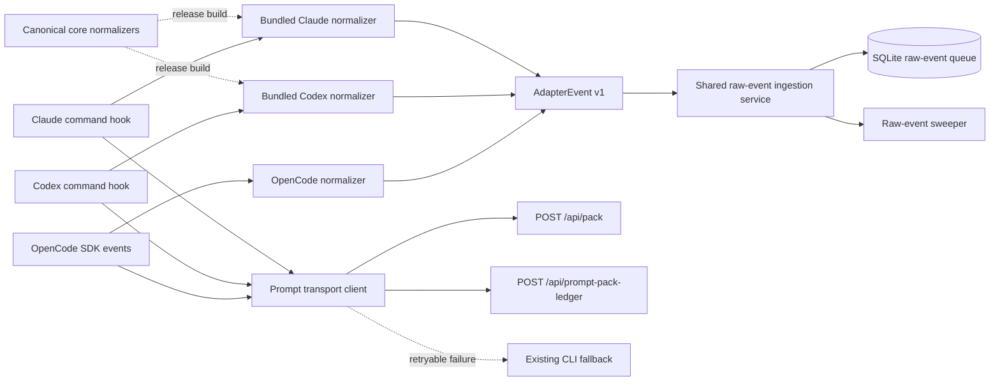

# Adapter interoperability and prompt transport parity

**Status:** Approved after architecture review

**Date:** 2026-08-15

**Decision:** Use normalized `POST /api/raw-events` as the only canonical event
ingress. Keep source-specific normalization at the adapter edge, generated from
one versioned core implementation. Do not add `/api/hooks` or `/api/events`.

## Problem

OpenCode now retrieves prompt packs and records prompt-pack ledger transitions
through the long-lived Viewer without starting `codemem pack` or
`prompt-pack-ledger` subprocesses on the healthy path. Claude Code and Codex do
not have equivalent behavior. Their prompt hooks start `codemem` or `npx`
processes, and their inject commands build from SQLite before trying Viewer HTTP.

Event ingestion is also asymmetric:

- OpenCode normalizes SDK events and posts them to `POST /api/raw-events`.
- Claude posts native hook payloads to `POST /api/claude-hooks`.
- Codex posts native hook payloads to `POST /api/codex-hooks`.

The two named hook routes repeat parsing, persistence, session metadata, sweeper
nudge, and response logic. More adapters would otherwise add more named routes
and more opportunities for behavior drift.

`POST /api/raw-events` is not adapter-neutral yet. Its batch store path currently
defaults stream identity and sweeper routing to OpenCode and does not honor a
request source. Source-aware canonical ingestion is therefore a prerequisite,
not an already-shipped capability.

The hooks cannot be treated as identical inputs. Claude and Codex expose
different lifecycle events and metadata, and OpenCode emits an SDK event stream
rather than command-hook payloads. The design must unify transport and
persistence after normalization while retaining source-specific normalization at
the boundary.

## Goals

- Give Claude and Codex direct Viewer-backed prompt pack and ledger paths.
- Start zero `codemem` or `npx` child processes on healthy Claude, Codex, and
  OpenCode prompt paths. Claude and Codex still start the hook process required by
  their host runtimes.
- Define one adapter-neutral normalized event contract and one persistence path.
- Preserve both stable event identity and event-sequence semantics across HTTP,
  direct fallback, spool replay, and version skew.
- Preserve source-specific hook information, event identity, and output formats.
- Replace per-agent HTTP routes with resource-oriented contracts.
- Keep version-skew failures bounded. Never read from a database or runtime
  identity-mismatched Viewer; classified fallback may use the intended local
  configuration instead.
- Retain local CLI/database or spool fallback for retryable Viewer failures.
- Separate runtime transport changes from human-facing CLI command-tree cleanup.

## Non-goals

- Making native Claude, Codex, and OpenCode event payloads identical.
- Removing the Claude or Codex normalizers.
- Combining event ingestion, pack retrieval, and delivery accounting into one
  endpoint.
- Changing memory ranking, pack content, token budgets, or compression defaults.
- Changing hook availability or lifecycle semantics supplied by host products.
- Removing compatibility CLI commands in the transport-parity change.
- Claiming literally zero processes for command-hook hosts.
- Allowing HTTP request data to expand the Viewer's local file-read authority.

## Current boundaries

### Source-specific inputs

Claude currently supports `SessionStart`, `UserPromptSubmit`, `PreToolUse`,
`PostToolUse`, `PostToolUseFailure`, `Stop`, and `SessionEnd`. Its mapper can
preserve permission mode, tool-use identity, failed-tool detail, transcript
fallback, and assistant usage.

Codex currently supports `SessionStart`, `UserPromptSubmit`, `PreToolUse`,
`PostToolUse`, and `Stop`. Its mapper additionally handles target metadata,
turn identity, matcher aliases, model/subagent fields, generated event nonces,
and different Stop-event deduplication. It does not currently capture Claude's
failed-tool or session-end equivalents, and it intentionally omits Stop usage.

OpenCode receives structured SDK events in-process. It supplies its own event
sequence, monotonic and wall-clock timing, working-set state, and plugin lifecycle
metadata before posting normalized raw events.

### Shared normalized layer

The existing `AdapterEvent v1` shape already establishes the useful boundary:

- schema version;
- source provenance;
- source session identity;
- stable event identity and normalized event type;
- timestamp and ordering confidence;
- working directory;
- normalized payload;
- source-specific metadata, including preserved unknown hook fields.

Normalization must remain loss-aware. Fields that do not map to common event
semantics remain under source metadata instead of being discarded or promoted
into unrelated common fields.

## Architecture



The architecture has three layers:

1. **Source adapters** understand native lifecycle and payload semantics.
2. **Normalized services** own event persistence, retrieval, and ledger behavior.
3. **Compatibility plumbing** handles temporary version skew without becoming a
   second implementation.

Dependency direction is strict:

```text
plugins/*  -> generated adapter artifact -> normalized Viewer contracts
viewer-server routes -> core ingestion/retrieval/ledger services
CLI fallback -> core ingestion/retrieval services
```

Core must not import Viewer, CLI, or plugin modules. Viewer routes and CLI
commands are peer clients of core services.

## Ingestion API boundary

Architecture review considered three options.

### Chosen: normalized raw-event ingress only

```text
POST /api/raw-events  AdapterEvent/raw-event envelope
```

Claude and Codex plugin bundles normalize before sending the request. OpenCode
continues normalizing its SDK event stream in-process.

Advantages:

- one canonical event-ingress endpoint;
- Viewer has no native hook payload knowledge;
- adapters fully own their source protocol and trusted transcript access;
- an HTTP body cannot direct the long-lived Viewer to resolve native transcript
  paths or gain file-read capability.

Costs:

- the current mappers include transcript handling, event identity, unknown-field
  preservation, project inference, and source-specific deduplication;
- standalone marketplace bundles need generated mapper artifacts;
- event identity must be frozen and versioned so cached plugin artifacts remain
  safe during skew.

The authored source remains in core. Release tooling produces dependency-free,
single-file ESM artifacts for each independently distributed plugin. Golden
fixtures must prove that core, generated artifacts, and CLI fallback produce
byte-identical normalized envelopes and event IDs.

### Rejected: separate native-hook ingress

```text
POST /api/hooks       { source, payload }
POST /api/raw-events  AdapterEvent/raw-event envelope
```

This is a valid anti-corruption-layer pattern in systems where both request
types cross the same trust boundary. It is rejected here because native hook
normalization includes transcript path resolution. Performing that work in the
Viewer would let an unauthenticated loopback HTTP request expand the Viewer's
file-read authority. The hook process already receives the path from its host and
is the correct boundary for that access.

### Rejected: one discriminated event endpoint

```text
POST /api/events
{ format: "native-hook", source, payload }
{ format: "adapter-event-v1", event }
```

Advantages:

- one URL for all event ingress;
- preserves server-side native normalizers.

Costs:

- one endpoint owns two abstraction levels and two validation models;
- retry, diagnostics, and compatibility behavior branch on request format;
- the apparently simple URL hides rather than removes architectural distinction.

It also preserves server-side native normalization and its trust problem while
making validation, diagnostics, and retry behavior branch on a format field.

## Canonical event ingestion service

Extract route-independent ingestion functions that accept one normalized event
or batch plus session metadata. They own:

- body-independent schema validation;
- source and stream identity validation;
- private-field stripping;
- stable idempotent insertion;
- event sequence assignment;
- raw-event session metadata updates;
- per-source sweeper nudge;
- `{ inserted, skipped, received }` outcome shaping.

Routes parse transport input and call this service. Direct CLI fallback also uses
the same core ingestion operation rather than maintaining source-specific SQL.

The source-aware batch method replaces the current OpenCode-defaulting batch
path. `POST /api/raw-events` accepts and honors a validated `source`; requests
without it default to `opencode` during compatibility. Source tokens are trimmed,
case-normalized, length-bounded provenance identifiers. They do not grant trust.

The canonical service allocates first-event sequence `0` for every source and
preserves the same sequence rules for HTTP, direct fallback, and spool replay.
Source-specific direct SQL is removed; existing Claude and Codex fallback SQL has
not remained uniform on this invariant. Codex's `-1` default is the reference;
Claude's current `0` default is repaired by moving both paths to the service.

`source` is provenance, not an authorization principal. Validate its syntax and
length, but do not grant access or change trust based on its value.

## Frozen event identity

Event identity becomes an explicit versioned contract rather than an incidental
property of whichever mapper version runs:

```text
event_id = f(event_id_algo, source, session, hook event, timestamp seed,
             source discriminators, canonical payload hash)
```

Add `meta.event_id_algo` to the normalized event contract, initially `claude/1`
and `codex/1`. Keeping the discriminator under `meta` preserves compatibility
with the closed AdapterEvent v1 top-level schema. Changing canonicalization,
discriminators, or hashing requires a new algorithm version. Golden fixtures
cover timestamp-less retries, transcript fallback, tool calls/results, unknown
fields, and generated nonces. OpenCode is explicitly exempt because it assigns a
stable random event ID at event creation rather than deriving one from payload.

## Prompt retrieval and ledger flow

Prompt retrieval remains adapter-neutral:

```text
POST /api/pack
POST /api/prompt-pack-ledger
```

Each adapter retains source-specific query construction and output formatting:

- Claude includes its first/last prompt and working-set state where available and
  returns Claude's `hookSpecificOutput.additionalContext` contract.
- Codex keeps its lean prompt-plus-project query until it gains equivalent session
  state and returns Codex's `additionalContext` contract.
- OpenCode retains its existing message and compaction injection surfaces.

On a healthy path:

1. The hook adapter creates query, filters, render options, and attempt metadata.
2. It validates Viewer profile/database/runtime identity.
3. It sends `POST /api/pack` with attempt metadata. Viewer builds the pack and
   records retrieval artifacts best-effort.
4. The adapter formats and writes the host-specific context response.
5. It sends `POST /api/prompt-pack-ledger` with delivered, empty, skipped,
   cached, or failed status as appropriate.

Pack delivery must not wait indefinitely for ledger completion. Ledger recording
is bounded to at most 500 ms, never retried inline, and never delays hook output.
Failure leaves delivery truth `unknown`; it must not be rewritten as handed off.

Claude and Codex migrate from unauthenticated legacy `GET /api/pack` to the
identity-gated `POST /api/pack`. Their transport order becomes Viewer HTTP first,
then classified local CLI fallback. The legacy GET route is deprecated after all
shipped callers migrate.

## Fallback classification

Local fallback is allowed for:

- connection refusal or reset;
- bounded timeout;
- Viewer unavailable during restart;
- a Viewer profile endpoint that is absent or reports an unsupported
  `protocol_version`;
- malformed transport responses that indicate protocol incompatibility rather
  than a valid request rejection;
- Viewer database or runtime identity mismatch, because fallback targets the
  adapter's intended local configuration instead of reading from the mismatched
  Viewer. The client must not retry against that same Viewer in the request path.

Fallback is not allowed for:

- invalid adapter requests;
- `viewer_contract_unsupported` returned after the profile reported a supported
  protocol version;
- explicit policy disablement;
- authorization or trust failures if local transport later gains authentication.

The existing CLI inject path remains the compatibility fallback initially. It
must produce the same source query and host output contract. Direct event fallback
uses the normalized ingestion service or durable spool and must preserve event
identity.

All adapters use one classifier. Every request-contract change that an older
Viewer would reject increments the profile `protocol_version`. The profile also
advertises `min_supported_protocol_version`, and clients accept an explicit
supported range rather than requiring literal equality. A non-overlapping range
is version skew and may fall back; `viewer_contract_unsupported` after a
compatible profile match is a client/contract defect and fails closed. This
replaces OpenCode's current behavior of requiring protocol `1` and treating every
such 409 as retryable, avoiding needless subprocess fallback when a newer Viewer
still supports an older client.

## Compatibility and rollout

Plugin, CLI, and Viewer versions can skew because marketplace caches, local PATH
installs, npm packages, and long-running Viewer processes do not update
atomically.

During the compatibility window, expected to span at least two stable releases:

- `/api/claude-hooks` retains the hardened legacy normalizer, then delegates its
  normalized output to the canonical ingestion service;
- `/api/codex-hooks` does the same for Codex;
- aliases contain no persistence, sequence, or session-update logic of their own;
- tests prove old request shapes produce the same normalized event and ingestion
  result as the canonical route.

New adapters stop calling named routes in the first parity release. Remove aliases
only when repository and packaged-plugin searches show no remaining callers and
the stale-client fallback matrix passes. Evidence is the binding removal gate;
elapsed releases alone are insufficient.

New prompt transports must probe the Viewer profile/contract and fall back safely
when paired with a pre-parity Viewer. A newer Viewer must continue accepting the
old hook clients during the compatibility window.

## CLI command-tree cleanup

Transport parity and CLI cleanup should form separate review units.

After adapters call HTTP directly on healthy paths:

- classify `claude-hook-*`, `codex-hook-*`, `enqueue-raw-event`,
  `prompt-pack-ledger`, and similar commands as adapter plumbing;
- remove plumbing commands from shell completion and human-oriented root help
  where compatibility permits;
- retain stable stdin/stdout and exit-code contracts while installed plugins can
  still call them;
- consolidate duplicated wrappers around shared transport/fallback functions;
- follow the documented deprecation window before deleting command aliases;
- keep command-tree registration, visible help, and completion parity tested.

The transport change must not be delayed on unrelated human-facing command
renames.

## Security and privacy

- Bind all adapter HTTP transport to configured local Viewer endpoints; do not
  add external egress.
- Preserve body-size limits and reject non-object native payloads.
- Strip private fields before persistence regardless of ingress route.
- Do not log prompts, pack text, raw hook bodies, database paths, or identity
  payloads in normal diagnostics.
- Validate database and runtime identity before Viewer-backed retrieval.
- Treat source as untrusted provenance data.
- Move transcript access to generated hook-edge normalizers before canonical HTTP
  submission.
- Generated edge normalizers may read the exact `transcript_path` supplied by the
  host hook, but read at most the final 16 MiB of a transcript and align parsing to
  the next complete JSONL record.
- Before retaining legacy named routes, give the core transcript reader an
  explicit allowlist. Absolute Claude paths must resolve beneath
  `${CLAUDE_CONFIG_DIR:-$HOME/.claude}/projects`; absolute Codex paths must resolve
  beneath `${CODEX_HOME:-$HOME/.codex}/sessions`. Legacy HTTP routes reject
  relative paths because request-controlled `cwd` must not become an implicit
  filesystem root. Trusted hook-edge callers may resolve a relative path beneath
  the host's real `cwd`. Resolve symlinks before containment checks, read at most
  the final 16 MiB, and reject every other path. Mapper fixtures pass their
  temporary directory as an explicit test allowlist so existing transcript
  fallback behavior remains covered.
- Slice 1 verifies those default roots against current Claude and Codex host
  behavior before enabling the allowlist. A host relocation produces a benign
  skip rather than a hook failure; legacy HTTP routes return only a fixed,
  path-free `skip_reason`. Configured approved roots can bridge host version skew
  without permitting arbitrary request paths.
- Verification on 2026-08-15 found that Claude Code 2.1.207 and Codex CLI 0.147.0
  emit absolute `transcript_path` and `cwd` values beneath their configured roots;
  both custom home variables relocate transcript persistence as expected.
- Loopback is the current transport boundary, not authentication. Do not describe
  loopback reachability as authorization.

## Testing and evidence

### Contract tests

- Claude, Codex, and OpenCode fixtures normalize to AdapterEvent v1 without losing
  source-only metadata.
- Canonical and compatibility hook routes produce identical envelopes and
  insertion outcomes.
- HTTP and direct/spool fallback preserve event IDs and deduplicate retries.
- HTTP, direct, and spool paths allocate identical event sequences.
- Legacy native-hook and canonical raw-event validation errors are deterministic
  and bounded.

### Prompt transport tests

- Healthy Claude and Codex pack and ledger paths start no `codemem` or `npx`
  children.
- Delivered, empty, skipped, cached, and failed transitions reach the ledger.
- Retryable Viewer failures invoke exactly one classified fallback path.
- invalid or unsupported requests do not fall back; database/runtime identity
  mismatch triggers local fallback without retrying the mismatched Viewer.
- Host-specific `additionalContext` output remains byte-compatible where required.
- Claude's healthy prompt hook runs as Node/ESM rather than invoking `curl`,
  `codemem`, or `npx` from shell.

### Packaging and performance evidence

- Claude and Codex packaged-plugin smoke tests run without a globally installed
  CLI while Viewer is healthy.
- A stale-client/new-Viewer and new-client/stale-Viewer matrix validates the
  compatibility window.
- A 30-run development benchmark reports median and p95 hook latency plus child
  process counts for direct CLI, healthy Viewer, and classified fallback paths.
- No benchmark artifacts contain prompts, memory text, IDs, or local paths.

## Delivery slices

1. Verify current host transcript roots, then harden path containment and size
   limits on existing server-side native-hook normalization before expanding
   transport work.
2. Extract a source-aware canonical ingestion service, repair sequence parity,
   and move existing raw-event routes and CLI fallbacks onto it without changing
   the HTTP request schema.
3. Freeze versioned event identity and add cross-artifact golden fixtures.
4. Extend the `/api/raw-events` HTTP request schema to honor source, add its
   `opencode` compatibility default once, and reduce named hook routes to
   compatibility adapters over the canonical service.
5. Generate standalone Claude and Codex mapper artifacts; convert Claude's prompt
   hook to Node/ESM; cut new plugins over to normalized `/api/raw-events`.
6. Add Claude direct profile/pack/ledger transport with classified CLI fallback.
7. Add Codex direct profile/pack/ledger transport with classified CLI fallback.
8. Run packaged skew/parity/performance evidence and update plugin documentation.
9. Perform the separate CLI plumbing/help/completion cleanup.
10. Remove named hook aliases and legacy `GET /api/pack` only after the
    compatibility evidence passes.

## Architecture review disposition

Architecture review returned **revise** on the initial `/api/hooks` proposal and
established these decisions:

- `/api/raw-events` becomes the sole canonical normalized ingress after it is
  made source-aware.
- Native hook normalization runs at the trusted hook edge using generated
  artifacts from one core source.
- Event identity and event sequence are both cross-transport invariants.
- CLI fallback calls the route-independent core ingestion service; duplicated
  direct SQL is not an acceptable durability boundary.
- Pack retrieval and delivery ledger remain separate. Only the adapter can report
  whether host handoff occurred, and ledger failure must not block injection.
- Named hook routes remain temporary compatibility adapters for two releases and
  until stale-client evidence permits removal.
- CLI cleanup remains a separate review unit.

## Related documents

- `docs/plans/2026-03-02-multi-agent-adapter-architecture-design.md`
- `docs/plans/adapter-event-v1.schema.json`
- `docs/plans/2026-05-28-codex-first-class-integration.md`
- `docs/plans/2026-08-10-release-0.41-fast-focused-recall-design.md`
- `docs/plans/2026-08-11-cli-operational-status-and-command-tree-consolidation-design.md`
- `docs/cli-design-conventions.md`
