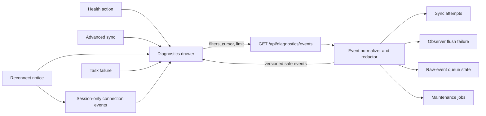

# Contextual redacted diagnostics drawer

**Status:** Approved
**Date:** 2026-09-07
**Related:** `codemem-fro6.6`, `codemem-fro6.7`

## Decision summary

Codemem will provide nearby operational evidence through a contextual drawer backed by a new bounded, server-redacted event endpoint.

- Add `GET /api/diagnostics/events` rather than composing unrelated status payloads in the browser.
- Normalize selected operational records into a small event contract; never expose raw event payloads or server logs.
- Open a modal side drawer from Health, Advanced, reconnect notices, and relevant task failures.
- Redact sensitive fields by default and require an explicit, session-only action to reveal bounded technical detail.
- Reuse source-table retention and cap every response so the feature does not create another log corpus.
- Keep Health, Advanced sync diagnostics, and Context Inspector as distinct task surfaces.

## Why this matters

Users currently leave the failing workflow to piece together Health summaries, observer failures, raw-event queue state, and sync attempts.

Health computes useful risk signals, but it exposes summaries and command recommendations rather than a recent event sequence. Advanced sync diagnostics expose five attempts and richer state, but they cover only sync. Settings shows the latest observer failure, while reconnect handling provides browser-session state without durable history.

The drawer should answer four questions without becoming a terminal:

1. What failed or changed recently?
2. Which subsystem produced the signal?
3. What can the user safely do next?
4. How can the user return to the interrupted task?

## Existing endpoint assessment

The current endpoints provide source data but cannot safely supply one coherent drawer contract without browser-side policy duplication.

| Source | Useful evidence | Gap for the drawer |
| --- | --- | --- |
| `/api/health` | Viewer readiness and database reachability | Snapshot only; includes process metadata that the drawer does not need |
| `/api/observer-status` | Active observer, queue totals, latest processing failure | One failure only; stored error text is not a stable user-safe event contract |
| `/api/raw-events` | Aggregate pending queue totals | No recent processing sequence or stable recovery codes |
| `/api/raw-events/status` | Recent session queue state and ingest limits | Includes project, working-directory, and session identifiers; unsuitable as a default drawer payload |
| `/api/sync/status` | Daemon, peer, retention, cleanup, and five recent attempts | Large mixed-purpose response; `includeDiagnostics=1` reveals identifiers, addresses, and stored errors |
| `/api/sync/attempts` | Bounded attempt history with server redaction | Sync-only schema; no observer, capture, storage, or maintenance events |

The first slice therefore needs `GET /api/diagnostics/events`. The server remains the only place that maps stored records to safe messages, stable codes, and redacted correlation labels.

## Information architecture boundaries

Each surface keeps one job so diagnostics do not become another competing navigation area.

- **Health** answers “Is Codemem working?” with current summaries and recommended actions.
- **Advanced sync diagnostics** answer “What is the detailed state of sync configuration, peers, retention, and attempts?”
- **Diagnostics drawer** answers “What operational events explain the problem I am handling now?”
- **Context Inspector** answers “Why did retrieval select, drop, deduplicate, or trim these memories?”
- **Server logs and raw events** remain developer or CLI evidence and do not appear in the drawer.

The drawer is contextual UI, not a seventh canonical tab and not a permanent feed overlay.

## Entry points and initial context

Every entry point opens the same drawer and supplies an initial filter rather than routing users away from their task.

| Entry point | Initial context |
| --- | --- |
| Health overall or pipeline card | Active risk driver and matching subsystem |
| Health recommended action | Recovery-related code or subsystem |
| Advanced sync diagnostics | `subsystem=sync` |
| Reconnect notice | Session-only `subsystem=viewer` connection events |
| Observer or processing failure | `subsystem=observer` or `subsystem=capture` |
| Maintenance failure | `subsystem=maintenance` and matching stable code |

The first visible row explains the supplied filter. Users can then change severity and subsystem filters without losing the original page beneath the drawer.

## Drawer interaction

The drawer uses modal dialog semantics to avoid ambiguous keyboard behavior while preserving the interrupted page visually.

| Behavior | Decision |
| --- | --- |
| Desktop placement | Right side, full height |
| Desktop width | Minimum 420px; preferred 42vw; maximum 640px |
| Narrow viewport | Full-screen sheet below 700px |
| Resize | No user resizer in the first slice |
| Close | Escape, labeled close button, or overlay dismissal |
| Focus | Focus the title or first filter on open; restore the invoking control on close |
| Persistence | Open state and filters last for the browser session only; no sensitive state in local storage |
| Initial page | 50 newest matching events |
| Request maximum | 100 events |
| Refresh | Existing five-second cadence while open, visible, connected, and not paused |

Polling must not steal focus or move the user’s scroll position. When newer events arrive while the user is reading older rows, the drawer shows a “New events” control instead of inserting rows immediately.

## Event contract

The endpoint returns a versioned envelope with normalized, presentation-safe events.

```ts
type DiagnosticEventSeverity = "info" | "warning" | "error";

type DiagnosticEventSubsystem =
	| "viewer"
	| "observer"
	| "capture"
	| "sync"
	| "storage"
	| "maintenance";

type DiagnosticEvent = {
	id: string;
	occurred_at: string;
	severity: DiagnosticEventSeverity;
	subsystem: DiagnosticEventSubsystem;
	code: string;
	message: string;
	recovery?: { label: string; href?: string; command?: string };
	correlation?: { kind: "session" | "device" | "operation"; label: string };
	technical_detail?: { available: boolean; text?: string };
};

type DiagnosticEventsResponse = {
	contract_version: 1;
	items: DiagnosticEvent[];
	next_cursor: string | null;
	redacted: boolean;
	generated_at: string;
};
```

`id` is an opaque event identity suitable for keyed rendering and cursor stability. `code` is an allowlisted product code, not an exception class or raw provider error. `message` describes the user impact in bounded language. Recovery actions use known internal routes or allowlisted CLI commands.

## Endpoint contract

The endpoint uses constrained query parameters and rejects unsupported values.

```text
GET /api/diagnostics/events
  ?limit=50
  &cursor=<opaque>
  &severity=warning,error
  &subsystem=observer,capture
  &includeTechnical=0
```

- `limit` defaults to 50 and is clamped to 100.
- `cursor` encodes the prior page’s timestamp and stable tie-breaker; clients do not construct it.
- `severity` and `subsystem` accept only contract enum values.
- `includeTechnical=1` requires an explicit browser-session reveal action.
- Responses set `Cache-Control: no-store`.
- The route is read-only and exposes no clear or delete method.

The first server adapter reads recent sync attempts, the latest observer flush failure, active maintenance jobs, and raw-event backlog state. Viewer reconnect events originate in `app.ts`, use the same browser type, and are prepended as session-only items because the unavailable server cannot record them reliably.

## Data flow

The server owns event normalization and privacy policy; the browser owns context, display state, and ephemeral connection events.



## Redaction and technical detail

Default responses reveal outcomes, not local topology or captured content.

The normalizer must omit absolute paths, database identifiers, hostnames, addresses, peer and session identifiers, prompts, memory content, transcripts, raw events, raw commands, credentials, invite payloads, arbitrary exception strings, and provider response bodies.

Default messages come from an allowlisted map keyed by source state and stable code. Technical detail requires an explicit session-only reveal action and remains field-allowlisted, secret-scrubbed, and bounded to 2,000 characters. Closing the drawer resets the reveal state.

## Threat and privacy review

The primary risk is converting safe summaries into an accidental local-data export surface.

| Threat | Control |
| --- | --- |
| Stored error contains a secret or prompt fragment | Never use arbitrary stored errors in default messages; scrub and bound gated details |
| Raw-event status exposes working directory or project identity | Do not pass through `/api/raw-events/status` rows |
| Sync diagnostics expose peer addresses or device identity | Default to aliases and stable codes; gate selected technical fields |
| Copy action bypasses the user’s awareness | Copy redacted visible events only after a sensitivity warning |
| Cursor leaks database row identity | Encode an opaque timestamp and tie-breaker cursor |
| Browser accumulates an unbounded history | Keep only current bounded pages; discard state on drawer close or navigation |
| Polling amplifies database load | Poll only while visible and open; query indexed recent rows with hard limits |
| “Clear” implies destructive deletion | Label it “Clear view”; reset client state and send no mutation request |

## Retention and performance

The drawer does not create a diagnostics table or persist fetched events in browser storage.

Events remain subject to their source retention. The endpoint selects bounded columns, applies hard query limits, returns at most 100 events, bounds safe messages to 500 characters, avoids network calls and long-running probes, and orders results by timestamp and a stable tie-breaker.

## Loading, empty, and failure states

Each state says what happened and what the user can do next.

- **Loading:** Keep the title, filters, pause control, and close button stable while skeleton rows occupy the list.
- **Empty:** Explain that no events match the recent retained window and offer “Reset filters.”
- **Disconnected:** Show session-only connection attempts and load server history after reconnection.
- **Request failed:** Keep existing rows marked stale, show retry, and preserve filters.
- **Paused:** Keep the last generated timestamp visible and offer “Resume updates.”
- **New events waiting:** Preserve scroll position and reveal the count behind “Show new events.”

## Clear, copy, and export semantics

The first slice permits clearing presentation state and copying safe evidence, not deleting records or exporting raw details.

- **Clear view** removes current browser rows and resets the cursor. The next refresh may show retained events again.
- **Copy visible events** copies only displayed redacted fields after a sensitivity warning.
- **Delete diagnostic data** does not exist in the drawer.
- **Unredacted copy and file export** require a separate privacy review.

## Accessibility

The drawer uses the existing Radix dialog primitive and adds side-sheet styling rather than implementing focus management from scratch.

- Link the visible title and description through dialog accessibility attributes.
- Use modal dialog semantics at every viewport size.
- Restore focus to the trigger or its owning card or tab when polling replaced it.
- Distinguish severity by text and icon, not color alone.
- Announce load failures and queued-event counts through a restrained live region.
- Respect reduced motion and keep every action keyboard reachable.

## Initial implementation slice

The first visible slice includes the smallest set that proves the contract across multiple subsystems.

### Server

- Add `packages/viewer-server/src/routes/diagnostics.ts` and register it in the viewer server.
- Normalize sync attempts, the latest observer failure, raw-event backlog severity, and active or failed maintenance jobs.
- Keep default output redacted and return `Cache-Control: no-store`.

### UI

- Add a diagnostics API client and session-only drawer state.
- Build the drawer with `packages/ui/src/components/primitives/radix-dialog.tsx`.
- Add initial entry points from Health and Advanced sync diagnostics.
- Reuse the application visibility and five-second refresh lifecycle while keeping drawer polling independently pausable.

### Tests

- Test ordering, cursor pagination, limit clamping, invalid filters, stable codes, bounds, headers, and every redaction class.
- Seed malicious stored errors containing paths, addresses, commands, prompts, and token-shaped secrets.
- Test entry-point filters, closing and focus return, keyboard filters, polling, queued events, loading, empty, disconnected, stale, and retry states.
- Prove “Clear view” sends no mutation request and copy includes only visible redacted fields.

## Staged rollout

Each stage remains independently testable and can stop without exposing a half-working console.

| Stage | Scope | Exit condition |
| --- | --- | --- |
| 1 | Endpoint, normalizers, privacy tests, no visible entry point | Contract and adversarial redaction tests pass |
| 2 | Drawer from Health and Advanced | Keyboard, focus, polling, responsive, and state tests pass |
| 3 | Reconnect and task-failure entry points; redacted copy | Dogfood confirms useful evidence without sensitive output or excessive noise |

## Explicitly deferred

The approved design excludes raw log streaming, raw-event inspection, log search, user-defined retention, destructive controls, persisted browser history, unrestricted export, unredacted copy, command execution, and a permanent diagnostics tab.

## Approval and implementation gate

This design was approved on 2026-09-07 and unblocks implementation for `codemem-fro6.7`.

Implementation must preserve the endpoint, privacy, scope, accessibility, and staged-rollout decisions above. Exposing raw stored errors, captured content, credentials, or unrestricted export requires a new privacy decision before coding.
