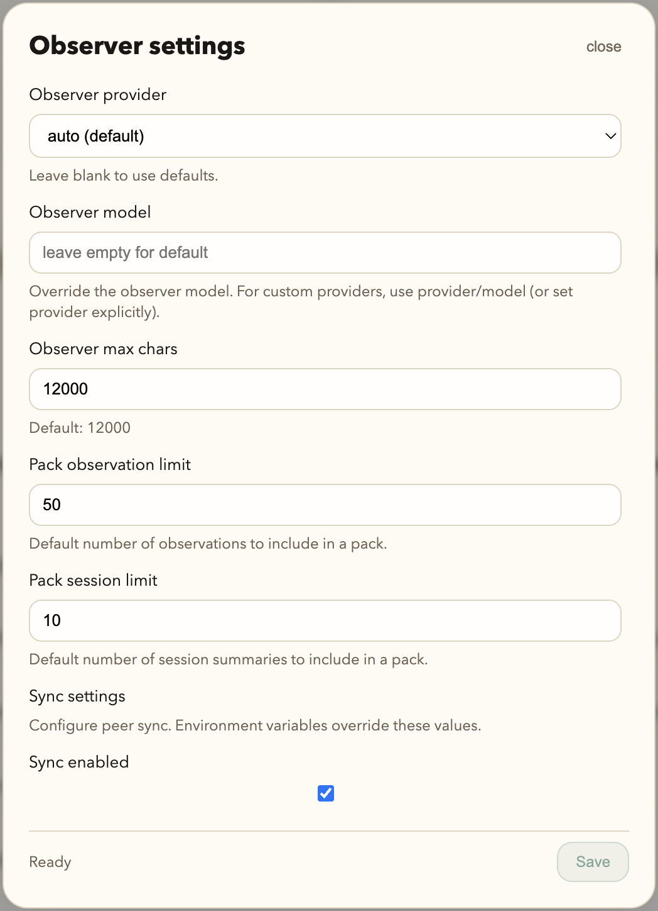

# Plugin Reference

This page covers advanced plugin behavior, environment variables, and stream reliability controls.

## Observer and settings UI



## Running OpenCode with the plugin

1. Start OpenCode inside this repo (or make the plugin global so it globs in everywhere).
2. Every tooling session creates memory artifacts in SQLite.
3. Use `codemem stats` and `codemem recent` to confirm ingestion.
4. Browse the viewer at the printed URL.

## Claude marketplace install

CodeMem's Claude integration is hook-first and distributed through a Claude plugin marketplace source in this repo (`.claude-plugin/marketplace.json`).

In Claude Code, add the marketplace and install the plugin:

```text
/plugin marketplace add kunickiaj/codemem
/plugin install codemem
```

Prerequisite: `uvx` must be available (provided by `uv`). If needed:

```bash
# Homebrew
brew install uv

# mise
mise use -g uv@latest
```

The plugin starts MCP with:

- `uvx codemem mcp`

We still recommend installing the CLI explicitly for local hook ingestion and manual `codemem` usage:

```bash
uv tool install --upgrade codemem
```

Claude MCP launch uses `uvx`; startup can be slower on first run because it may install dependencies on demand.

You can update an existing marketplace install with:

```text
/plugin marketplace update codemem-marketplace
```

Ingest one Claude hook payload from stdin (this is what the installed hook script calls):

```bash
printf '%s\n' '{"hook_event_name":"SessionStart","session_id":"sess-1","cwd":"/tmp/demo"}' | codemem ingest-claude-hook
```

By default, `SessionEnd` triggers an immediate queue flush attempt. Set `CODEMEM_CLAUDE_HOOK_FLUSH_ON_STOP=1` to also flush on `Stop`, or `CODEMEM_CLAUDE_HOOK_FLUSH=0` to disable hook-triggered flushes entirely.

The packaged template currently registers these hook events in `plugins/claude/hooks/hooks.json`:
- `SessionStart`
- `UserPromptSubmit`
- `PostToolUse`
- `PostToolUseFailure`
- `Stop`
- `SessionEnd`

`PreToolUse` is intentionally deferred in the default template. Current memory extraction uses `PostToolUse` / `PostToolUseFailure` (`tool_result`) as the shipped Claude tool signal.

## Post-restart config sanity checklist

After restarting OpenCode or the viewer, run this quick check when behavior looks off:

1. Confirm plugin + viewer are talking to the same DB path.
2. Check backend stats and recent writes (`codemem stats`, `codemem recent`).
3. Verify runner mode and source (`CODEMEM_RUNNER`, `CODEMEM_RUNNER_FROM`) match your install strategy.
4. Confirm injection controls are what you expect (`CODEMEM_INJECT_CONTEXT`, `CODEMEM_INJECT_LIMIT`, `CODEMEM_INJECT_TOKEN_BUDGET`).
5. If stream mode is enabled, check backlog health (`codemem raw-events-status`).

If needed, restart viewer + plugin flow:

```bash
codemem serve --restart
```

If compatibility toasts appear after restart, follow the runner-specific guidance in Compatibility guidance behavior below.

## Plugin tools exposed to the model

- `mem-status` - show viewer URL, log path, stats, and recent entries.
- `mem-stats` - show just the stats block.
- `mem-recent` - show recent items (defaults to 5).

These are plugin tools callable by the agent/runtime. They are not user-facing
slash commands in the OpenCode chat input.

## Observer model defaults

- OpenAI: `gpt-5.1-codex-mini`
- Anthropic: `claude-4.5-haiku`

Provider/model selection can be overridden with `CODEMEM_OBSERVER_PROVIDER` and
`CODEMEM_OBSERVER_MODEL`. Custom providers are loaded from OpenCode config.

### Observer auth modes (0.16)

Observer execution in `0.16` supports both API and Claude runtime paths.

- Runtime values: `api_http`, `claude_sidecar`.
- `claude_sidecar` runs observer calls via local Claude runtime auth (no `ANTHROPIC_API_KEY` required).
- `claude_sidecar` uses `claude_command` (or `CODEMEM_CLAUDE_COMMAND`) as argv prefix for launching Claude CLI. Default: `["claude"]`.
- Default models:
  - `api_http`: `gpt-5.1-codex-mini` unless `observer_model` is set.
  - `claude_sidecar`: `claude-4.5-haiku` unless `observer_model` is set.
- If `observer_model` is unsupported in Claude CLI, codemem retries once without `--model`.
- Supported auth sources: `auto`, `env`, `file`, `command`, `none`.
- Supported: API keys and gateway tokens codemem can read directly.
- Custom provider path does not implicitly fall back to OpenCode/IAP env tokens; use provider key, `CODEMEM_OBSERVER_API_KEY`, `file`, or `command`.

For command-refreshed gateway auth, configure a command token source plus templated headers:

```json
{
  "observer_provider": "your-gateway-provider",
  "observer_runtime": "api_http",
  "observer_auth_source": "command",
  "observer_auth_command": ["iap-auth", "--audience", "example"],
  "observer_auth_timeout_ms": 1500,
  "observer_auth_cache_ttl_s": 300,
  "observer_headers": {
    "Authorization": "Bearer ${auth.token}"
  }
}
```

`observer_auth_command` is direct argv execution (no shell interpolation).

- Config key type: JSON string array (`["cmd", "arg1", "arg2"]`).
- Env var `CODEMEM_OBSERVER_AUTH_COMMAND` must also be a JSON string array (for example `'["iap-auth","--audience","example"]'`), not a space-separated command string.

Header template variables:

- `${auth.token}`
- `${auth.type}`
- `${auth.source}`

Command/file token cache behavior:

- Successful token resolutions are cached for `observer_auth_cache_ttl_s`.
- Failed token resolutions are not cached.

## Stream-only mode (advanced)

Stream contract:
- Preflight availability: `GET /api/raw-events/status`
- Event streaming: `POST /api/raw-events`
- Non-2xx and network failures are treated as stream failures.
- Raw events are delivered through the viewer ingest API.
- Raw-event batches accepted by the viewer are retried by Python flush workers.

Suggested settings:

```bash
export CODEMEM_RAW_EVENTS_AUTO_FLUSH=1
export CODEMEM_RAW_EVENTS_DEBOUNCE_MS=60000
export CODEMEM_RAW_EVENTS_SWEEPER=1
export CODEMEM_RAW_EVENTS_SWEEPER_IDLE_MS=120000
export CODEMEM_RAW_EVENTS_SWEEPER_LIMIT=25
export CODEMEM_RAW_EVENTS_STUCK_BATCH_MS=300000
# optional retention
# export CODEMEM_RAW_EVENTS_RETENTION_MS=$((7*24*60*60*1000))
```

To monitor backlog:

```bash
codemem raw-events-status
```

If `raw-events-status` shows `batches=error:N` (legacy label) or `queue=... failed:N` for a session, retry:

```bash
codemem raw-events-retry <opencode_session_id>
```

## Hook lifecycle and flush boundaries

The plugin uses OpenCode event hooks and flushes on explicit lifecycle boundaries:

- `tool.execute.after`: queue tool event; contributes to force-flush thresholds.
- `session.idle`: immediate flush attempt.
- `session.created`: flush previous session buffer before switching context.
- `/new` prompt boundary: flush before session reset.
- `session.error`: immediate flush attempt.

Force-flush thresholds (immediate flush):
- `>=50` tool events, or
- `>=15` prompts, or
- `>=10` minutes session duration.

Failure semantics:
- Stream POST failures are backoff-gated in plugin runtime (`CODEMEM_RAW_EVENTS_BACKOFF_MS`).
- Availability checks are rate-limited (`CODEMEM_RAW_EVENTS_STATUS_CHECK_MS`).
- Accepted raw-event batches are retried by viewer/store queue workers (`codemem raw-events-retry`).

## Project label normalization

When ingesting plugin payloads, CodeMem stores a normalized project label instead of a full path.

- Path-like labels are reduced to the basename (for example, `/Users/adam/workspace/codemem` -> `codemem`).
- Windows-style paths are normalized with Windows path rules on every OS runtime.
  - `C:\Users\adam\workspace\codemem` -> `codemem`
  - `D:/dev/client-demo` -> `client-demo`
  - `\\server\share\team\project-x` -> `project-x`
- `CODEMEM_PROJECT` still has highest precedence and is normalized the same way.

### Multi-adapter project unification

If you run multiple adapters for the same project (for example OpenCode + Claude), set a shared `CODEMEM_PROJECT` value in both runtimes to guarantee unified project grouping in memory retrieval.

## Environment hints

| Env var | Description |
| --- | --- |
| `CODEMEM_RUNNER` | Override auto-detected runner: `uv` (dev mode), `uvx` (installed mode), or direct binary path. |
| `CODEMEM_RUNNER_FROM` | Override source location: directory path for `uv run --directory`, or git URL/path for `uvx --from`. |
| `CODEMEM_VIEWER` | Set to `0`, `false`, or `off` to disable the viewer entirely. |
| `CODEMEM_VIEWER_HOST`, `CODEMEM_VIEWER_PORT` | Customize the viewer host/port printed on startup. |
| `CODEMEM_VIEWER_AUTO` | Set to `0`/`false`/`off` to disable auto-start (default on). |
| `CODEMEM_VIEWER_AUTO_STOP` | Set to `0`/`false`/`off` to keep the viewer running after OpenCode exits (default on). |
| `CODEMEM_PLUGIN_LOG` | Path for the plugin log file (set `1`/`true`/`yes` to enable; defaults to off). |
| `CODEMEM_PLUGIN_LOG_PATH` | Explicit log file path for Claude hook script logging (overrides `CODEMEM_PLUGIN_LOG` for that script). |
| `CODEMEM_PLUGIN_CMD_TIMEOUT` | Milliseconds before a plugin CLI call is aborted (default `20000`). |
| `CODEMEM_MIN_VERSION` | Minimum required CLI version for plugin compatibility warnings (default `0.9.20`). |
| `CODEMEM_BACKEND_UPDATE_POLICY` | Backend update behavior on compatibility mismatch: `notify` (default), `auto`, or `off`. |
| `CODEMEM_CODEX_ENDPOINT` | Override Codex OAuth endpoint. |
| `CODEMEM_PLUGIN_DEBUG` | Set to `1`, `true`, or `yes` to log plugin lifecycle events. |
| `CODEMEM_PLUGIN_IGNORE` | Skip all plugin behavior for this process. |
| `CODEMEM_INJECT_CONTEXT` | Set to `0` to disable memory pack injection (default on). |
| `CODEMEM_INJECT_LIMIT` | Max memory items in injected pack (default `8`). |
| `CODEMEM_INJECT_TOKEN_BUDGET` | Approx token budget for injected pack (default `800`). |
| `CODEMEM_USE_OPENCODE_RUN` | Use `opencode run` for observer generation (default off). |
| `CODEMEM_OPENCODE_MODEL` | Model for `opencode run` (default `gpt-5.1-codex-mini`). |
| `CODEMEM_OPENCODE_AGENT` | Agent for `opencode run` (optional). |
| `CODEMEM_OBSERVER_PROVIDER` | Force `openai`, `anthropic`, or a custom provider key (optional). |
| `CODEMEM_OBSERVER_MODEL` | Override observer model (default `gpt-5.1-codex-mini` or `claude-4.5-haiku`). |
| `CODEMEM_OBSERVER_API_KEY` | API key for observer model (optional). |
| `CODEMEM_CLAUDE_COMMAND` | JSON argv array for Claude CLI invocation used by `claude_sidecar` (default `["claude"]`). |
| `CODEMEM_OBSERVER_RUNTIME` | Observer runtime mode (`api_http` or `claude_sidecar`). |
| `CODEMEM_OBSERVER_AUTH_SOURCE` | Observer auth source (`auto`, `env`, `file`, `command`, `none`). |
| `CODEMEM_OBSERVER_AUTH_FILE` | Path to token file used when auth source is `file`. |
| `CODEMEM_OBSERVER_AUTH_COMMAND` | Command argv as a JSON string array used when auth source is `command`. |
| `CODEMEM_OBSERVER_AUTH_TIMEOUT_MS` | Command auth timeout in milliseconds (default `1500`). |
| `CODEMEM_OBSERVER_AUTH_CACHE_TTL_S` | Cache TTL for command/file auth resolution in seconds (default `300`). |
| `CODEMEM_OBSERVER_HEADERS` | JSON object of templated observer headers, e.g. `{"Authorization":"Bearer ${auth.token}"}`. |
| `CODEMEM_OBSERVER_MAX_CHARS` | Max observer prompt characters (default `12000`). |
| `CODEMEM_RAW_EVENTS_BACKOFF_MS` | Backoff window after stream failure before retrying stream POSTs (default `10000`). |
| `CODEMEM_RAW_EVENTS_STATUS_CHECK_MS` | Minimum interval between stream availability preflight checks (default `30000`). |
| `CODEMEM_RAW_EVENTS_HARD_MAX` | Hard upper bound for in-memory plugin queue under sustained failure pressure (default `2000`). |
| `CODEMEM_RAW_EVENTS_AUTO_FLUSH` | Set to `1` to enable viewer-side debounced flush of streamed raw events (default off). |
| `CODEMEM_RAW_EVENTS_DEBOUNCE_MS` | Debounce delay before auto-flush per session (default `60000`). |
| `CODEMEM_RAW_EVENTS_SWEEPER` | Set to `1` to enable periodic sweeper flush for idle sessions (default on). |
| `CODEMEM_RAW_EVENTS_SWEEPER_INTERVAL_MS` | Sweeper tick interval (default `30000`). |
| `CODEMEM_RAW_EVENTS_SWEEPER_INTERVAL_S` | Config/env interval in seconds used by Settings UI (default `30`; overridden by `CODEMEM_RAW_EVENTS_SWEEPER_INTERVAL_MS` when set). |
| `CODEMEM_RAW_EVENTS_SWEEPER_IDLE_MS` | Consider session idle if no events since this many ms (default `120000`). |
| `CODEMEM_RAW_EVENTS_SWEEPER_LIMIT` | Max idle sessions to flush per sweeper tick (default `25`). |
| `CODEMEM_RAW_EVENTS_STUCK_BATCH_MS` | Mark flush batches older than this many ms as error (default `300000`). |
| `CODEMEM_RAW_EVENTS_RETENTION_MS` | If >0, delete raw events older than this many ms (default `0`, keep forever). |
| `CODEMEM_CLAUDE_HOOK_FLUSH` | Set to `0` to disable immediate hook flush attempts (default on). |
| `CODEMEM_CLAUDE_HOOK_FLUSH_ON_STOP` | Set to `1` to flush on Claude `Stop` hooks in addition to `SessionEnd` (default off). |
| `CODEMEM_HOOK_ALLOW_UVX` | Set to `1` to allow Claude hook script fallback to `uvx --from codemem` when `codemem` binary is not found (default off). |

## Compatibility guidance behavior

When the plugin detects CLI/runtime version mismatch, it shows guidance based on runner mode:

- `CODEMEM_RUNNER=uv`: pull latest in your repo, run `uv sync`, restart OpenCode
- `CODEMEM_RUNNER=uvx` with git source: update `CODEMEM_RUNNER_FROM` to newer ref/source, restart OpenCode
- `CODEMEM_RUNNER=uvx` with custom source: update `CODEMEM_RUNNER_FROM`, restart OpenCode
- other/unknown runner: run `uv tool install --upgrade codemem`, restart OpenCode

Update policy:

- `CODEMEM_BACKEND_UPDATE_POLICY=notify` (default): show warning toast with suggested action
- `CODEMEM_BACKEND_UPDATE_POLICY=auto`: try a best-effort auto-update for eligible runners, then warn if still outdated
  - skipped in `uv` dev mode
  - skipped when `CODEMEM_RUNNER_FROM` is pinned to a git ref (for example `...git@vX.Y.Z`)
- `CODEMEM_BACKEND_UPDATE_POLICY=off`: no compatibility toast (logging still records mismatch)

Compatibility checks do not block plugin startup.
